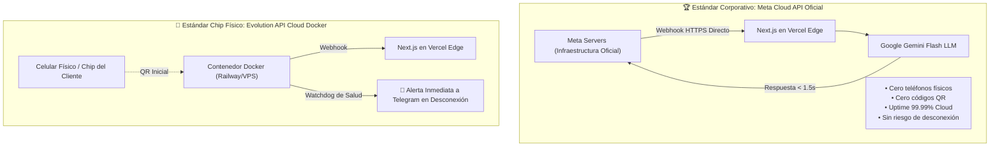
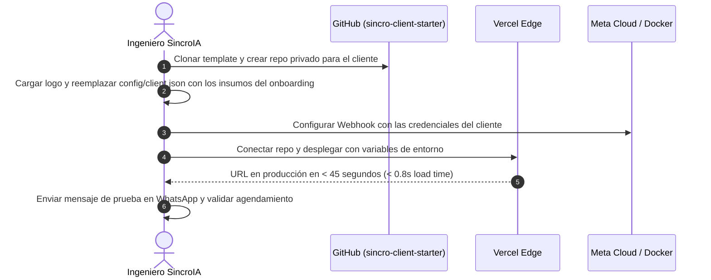

# 🏗️ ARQUITECTURA TÉCNICA PROFESIONAL: WHATSAPP 24/7 & LÍNEA DE ENSAMBLAJE DE CLIENTES
## SincroIA — Infraestructura Cloud & Boilerplate de Despliegue Rápido (< 2 Horas)

Este manual define la arquitectura de software oficial de SincroIA para garantizar **atención ininterrumpida 24/7 sin depender de celulares encendidos**, y el protocolo de ensamblaje modular para desplegar proyectos de clientes en menos de 2 horas.

---

## 1. EL TALÓN DE AQUILES DE WHATSAPP & LA SOLUCIÓN PROFESIONAL DUAL

Muchas agencias novatas conectan WhatsApp escaneando un código QR en una laptop local con librerías caseras. Si la laptop se apaga, no hay wifi o Meta desconecta la sesión, el cliente pierde ventas y la agencia entra en crisis.

En **SincroIA** implementamos una **Arquitectura Dual Profesional**:



---

### MODALIDAD A: Meta WhatsApp Cloud API Oficial (Recomendada para 24/7 Corporativo)

Esta es la opción que ofrecemos a clientes de planes **Agente IA Pro, E-commerce Pro y Ecosistema Total**:

1. **¿Cómo funciona?**
   - El número de teléfono se registra directamente en el **Meta Business Manager** del cliente (o en un número virtual voIP corporativo suministrado por SincroIA).
   - **No requiere teléfono físico encendido, no usa WhatsApp Web ni requiere escanear QR.**
   - Meta recibe el mensaje en sus servidores globales y dispara un Webhook HTTPS directo a nuestra ruta `app/api/agent/whatsapp/route.ts`.
   - Nuestro motor en Next.js consulta a Gemini Flash y responde a la API de Meta en menos de 1.5 segundos.

2. **Ventajas Absolutas:**
   - **Disponibilidad 99.99%:** Nunca se apaga por batería, wifi del cliente ni reinicio de celulares.
   - **Inmunidad ante bloqueos:** Es la API oficial de WhatsApp, respaldada contractualmente por Meta.
   - **Mensajería Masiva Oficial:** Permite enviar plantillas autorizadas (*templates*) para reactivación de carritos abandonados o promociones.

3. **Variables requeridas en `.env.local` del cliente:**
   ```env
   WHATSAPP_PROVIDER=meta_cloud
   WHATSAPP_PHONE_NUMBER_ID=10928374659281
   WHATSAPP_ACCESS_TOKEN=EAAG... (Token permanente de Meta)
   WHATSAPP_VERIFY_TOKEN=sincroia_secure_verify_token
   ```

---

### MODALIDAD B: Contenedor Cloud Dockerizado con Watchdog (Para Chips Físicos Existentes)

Si el cliente insiste en mantener su número en su chip SIM físico personal de WhatsApp Business:

1. **Alojamiento en Servidor Cloud 24/7:**
   - La sesión no corre en la máquina de SincroIA ni del cliente; corre en un contenedor Docker de **Evolution API** alojado en la nube (**Railway, Render o VPS dedicado Hetzner**).
   - Cuenta con **volumen de almacenamiento SSD persistente y Redis**, lo que significa que si el contenedor se reinicia, la sesión se restaura automáticamente en 3 segundos sin pedir nuevo QR.

2. **Watchdog de Salud Activo (Alerta a Telegram):**
   - El contenedor tiene configurado el webhook `connection.update`.
   - Si la sesión de WhatsApp cambia a estado `closed` o `loggedOut` (por ejemplo, si el cliente cambió de celular o la app de Meta forzó un cierre), el sistema envía una alerta inmediata al Telegram de soporte de SincroIA:  
     *`🚨 [ALERTA SINCROCARE] La línea de [Nombre Cliente] se ha desconectado. Generando enlace de reconexión rápida...`*
   - Esto permite solucionar cualquier eventualidad en minutos antes de que el cliente lo note.

---

## 2. LA LÍNEA DE ENSAMBLAJE: BOILERPLATE DE CLIENTES (< 2 HORAS)

Para entregar proyectos en 5 a 7 días hábiles con márgenes del 85%, el proceso de desarrollo debe ser una **fábrica de ensamblaje modular**, no una artesanía desde cero.

### 2.1 El Repositorio Base: `sincro-client-starter`

Cada nuevo cliente es un *fork* o clon del repositorio `sincro-client-starter`.  
Toda la personalización del cliente vive en un único archivo maestro: **`config/client.json`**:

```json
{
  "client": {
    "name": "Clínica Odontológica Sonrisas",
    "slug": "sonrisas-bogota",
    "category": "Salud Dental",
    "city": "Bogotá, Colombia",
    "contact": {
      "phone": "+57 310 123 4567",
      "whatsappNumber": "573101234567",
      "email": "citas@sonrisasbogota.com",
      "address": "Calle 100 # 15-20, Consultorio 402"
    },
    "branding": {
      "primaryColor": "#0284c7",
      "accentColor": "#38bdf8",
      "logoUrl": "/images/logo.png",
      "tagline": "Diseño de Sonrisas y Ortodoncia de Alta Gama"
    }
  },
  "agent": {
    "name": "Valentina",
    "role": "Asesora Odontológica Especializada",
    "tone": "Cálido, profesional y clínico empático",
    "calendarLink": "https://calendar.google.com/calendar/appointments/schedules/...",
    "faqs": [
      {
        "question": "¿Dónde están ubicados?",
        "answer": "Estamos en la Calle 100 # 15-20, Consultorio 402, Bogotá. Contamos con parqueadero privado."
      },
      {
        "question": "¿Tienen convenio con pólizas o prepagadas?",
        "answer": "Atendemos de forma particular y expedimos toda la documentación clínica para reintegro con Colmédica, Sura y Allianz."
      }
    ]
  },
  "catalog": [
    {
      "id": "blanqueamiento-led",
      "name": "Blanqueamiento Dental Láser / LED",
      "price": 450000,
      "description": "Sesión clínica de 60 minutos con peróxido de hidrógeno al 35% y luz fría LED. Resultados visibles el mismo día."
    },
    {
      "id": "valoracion-inicial",
      "name": "Valoración Inicial & Diagnóstico 3D",
      "price": 80000,
      "description": "Incluye radiografía periapical digital y plan de tratamiento personalizado con el especialista."
    }
  ]
}
```

---

### 2.2 Flujo de Entrega en 3 Pasos (45 Minutos de Ingeniería):



### 2.3 Beneficios de esta Metodología:
1. **Reducción de Bugs a Cero:** Todo el código de componentes, animaciones, accesibilidad y lógica de Gemini ya está testeado en producción.
2. **Entrega Ultrarrápida:** El cliente que entrega sus insumos un lunes puede ver su demo preliminar el martes en la tarde.
3. **Mantenimiento Masivo:** Si SincroIA optimiza el motor de Gemini o una función de Next.js, se puede propagar como una actualización a todos los clientes en minutos.
