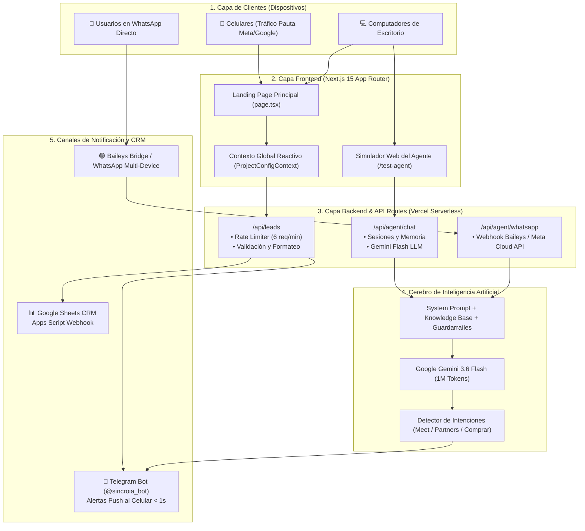
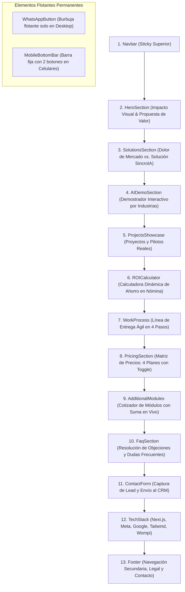
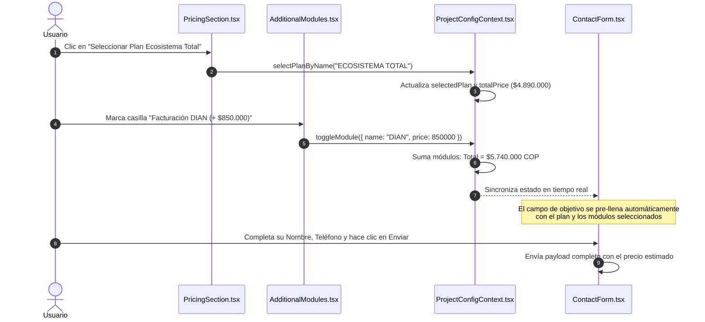
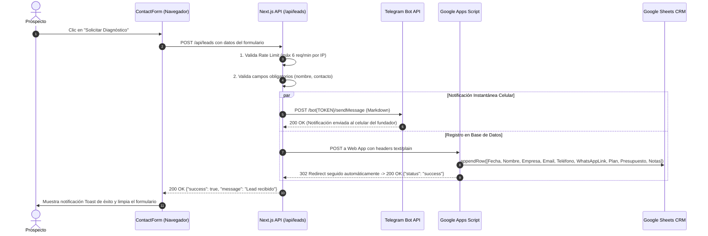
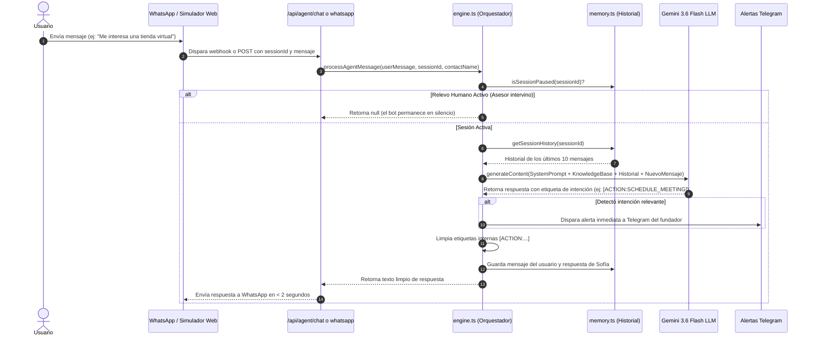

# 🗺️ BLUEPRINT TÉCNICO & ARQUITECTURA DE SOFTWARE
## SincroIA.lat — Estructura del Sistema, Flujos de Datos y Árbol de Componentes

**Versión:** 1.0 (Oficial)  
**Clasificación:** Documentación Técnica de Ingeniería & Arquitectura  
**Dominio Oficial:** [https://www.sincroia.lat](https://www.sincroia.lat)  

---

## 1. VISIÓN GENERAL DEL ECOSISTEMA TECNOLÓGICO

La plataforma de **SincroIA** está construida sobre una arquitectura moderna de **Frontend Reactivo en el Edge + API Serverless + Motor de Inteligencia Artificial Generativa + Integraciones de Mensajería en Tiempo Real**.



---

## 2. EL STACK TECNOLÓGICO & JUSTIFICACIÓN INGENIERIL

| Tecnología | Rol en SincroIA | ¿Por qué se eligió? |
|---|---|---|
| **Next.js 15 (App Router)** | Framework Core Full-Stack | Permite Server Components (carga < 0.8s) y rutas de API Serverless en un solo repositorio. |
| **React 19** | Biblioteca de UI | Máxima velocidad de renderizado, transiciones asíncronas y optimización de render en móviles. |
| **TypeScript** | Lenguaje de tipado estricto | Cero errores de tipos en tiempo de ejecución (`strict: true`), contratos de datos fiables. |
| **Tailwind CSS 3.4** | Motor de estilos atómicos | Cero hojas de estilo pesadas; solo compila las clases usadas (~13 KB de CSS total en producción). |
| **Framer Motion** | Animaciones físicas | Microinteracciones suaves y fluidas en menús, cards y acordeones a 60 FPS. |
| **Google GenAI SDK** | Motor de Inteligencia Artificial | Conexión directa a **Gemini 3.6 Flash** (tiempo de respuesta < 1.2s y costo de tokens ultra bajo). |
| **Baileys (@whiskeysockets)** | Gateway de WhatsApp Multi-Device | Conexión directa por WebSockets sin intermediarios costosos ni comisiones por mensaje. |
| **Sonner** | Notificaciones Toast | Alertas visuales no invasivas y accesibles en confirmación de formularios. |
| **Vercel Edge Network** | Infraestructura de Despliegue | Distribución CDN global con servidores en más de 300 ciudades para latencias mínimas en Colombia y LATAM. |

---

## 3. MAPA DE ARCHIVOS Y CARPETAS DEL PROYECTO

```
sincro-agency/
├── app/                                # Enrutador de Next.js (App Router)
│   ├── api/                            # Endpoints de Backend (Rutas Serverless)
│   │   ├── agent/                      # API del Asistente de IA
│   │   │   ├── chat/route.ts           # Endpoint para el widget/simulador web
│   │   │   └── whatsapp/route.ts       # Webhook receptor de WhatsApp
│   │   └── leads/route.ts              # Endpoint receptor de formularios y CRM
│   ├── globals.css                     # Estilos globales, variables de color y tipografías
│   ├── layout.tsx                      # Layout raíz, Providers, Fuentes y SEO Schema.org
│   ├── page.tsx                        # Landing Page comercial completa (One-Page)
│   ├── privacidad/page.tsx             # Política de Tratamiento de Datos (Ley 1581)
│   ├── terminos/page.tsx               # Términos y Condiciones Comerciales
│   ├── test-agent/page.tsx             # Simulador de chat interactivo para pruebas en vivo
│   ├── sitemap.ts                      # Generador automático de mapa del sitio para Google
│   └── robots.ts                       # Directivas de rastreo para motores de búsqueda
│
├── components/layouts/                 # Componentes visuales de la Landing Page
│   ├── Navbar.tsx                      # Barra de navegación superior con menú responsive
│   ├── HeroSection.tsx                 # Sección de impacto principal con CTAs de alta conversión
│   ├── SolutionsSection.tsx            # Comparativa Agencias Lentas vs. SincroIA
│   ├── AIDemoSection.tsx               # Demostrador interactivo por industrias (Salud, Retail, etc.)
│   ├── ProjectsShowcase.tsx            # Casos de éxito y portafolio de proyectos
│   ├── ROICalculator.tsx               # Calculadora interactiva de retorno de inversión
│   ├── WorkProcess.tsx                 # Paso a paso de entrega (4 fases ágiles)
│   ├── PricingSection.tsx              # Los 4 planes principales con selector reactivo
│   ├── AdditionalModules.tsx           # Cotizador interactivo de módulos adicionales
│   ├── FaqSection.tsx                  # Preguntas frecuentes con acordeón interactivo
│   ├── ContactForm.tsx                 # Formulario de diagnóstico conectado al CRM
│   ├── TechStack.tsx                   # Marcas y logos de tecnologías utilizadas
│   ├── Footer.tsx                      # Pie de página con enlaces legales y contacto
│   ├── WhatsAppButton.tsx              # Burbuja flotante de WhatsApp (Desktop)
│   └── MobileBottomBar.tsx             # Barra fija inferior para conversión en celulares
│
├── context/
│   └── ProjectConfigContext.tsx        # Estado global reactivo del cotizador de planes
│
├── lib/
│   ├── rate-limiter.ts                 # Limitador de peticiones en memoria contra ataques DoS
│   └── agent/                          # Motor interno de Sofía
│       ├── engine.ts                   # Orquestador del flujo: prompts + Gemini + acciones
│       ├── memory.ts                   # Almacenamiento en memoria de conversaciones y relevo humano
│       ├── prompt.ts                   # System prompt maestro de Sofía con guardarraíles
│       └── knowledge-base.ts           # Base de conocimiento enciclopédica de SincroIA
│
├── docs/                               # Suite documental, legal y operacional
│   ├── PLAN_DE_NEGOCIOS_SINCROIA.md
│   ├── CONTRATO_MARCO_SERVICIOS_SINCROIA.md
│   ├── PROTOCOLO_FLUJO_CLIENTE_SINCROIA.md
│   ├── MANUAL_DE_OPERACIONES_Y_PROTOCOLOS_SINCROIA.md
│   ├── GUIA_CONEXION_GOOGLE_SHEETS_CRM.md
│   ├── PLANTILLA_REPORTE_IMPACTO_SINCROCARE.md
│   └── ARQUITECTURA_FARM_CLIENTES_BOILERPLATE.md
│
└── templates/
    └── client.config.template.json     # Plantilla JSON para despliegue rápido de clientes
```

---

## 4. ANATOMÍA Y FLUJO VISUAL DE LA LANDING PAGE (`app/page.tsx`)

La página de inicio está diseñada bajo una estructura psicológica de **AIDA (Atención, Interés, Deseo, Acción)**:



### Detalle de Componentes Clave:

1. **`Navbar.tsx`:**  
   Barra superior con efecto *glassmorphism* (fondo translúcido con desenfoque). Contiene anclas directas a `#soluciones`, `#demo`, `#precios`, `#roi` y un botón de llamada a la acción ("Cotizar Proyecto").

2. **`HeroSection.tsx`:**  
   Titular de alto impacto orientado a la velocidad y la automatización. Incluye badges dinámicos ("⚡ Next.js 15 Edge", "🤖 Gemini Flash"), llamada a la acción hacia el formulario y botón de prueba directa en WhatsApp.

3. **`AIDemoSection.tsx`:**  
   Permite al visitante alternar entre 4 escenarios interactivos en vivo (Clínicas dentales, Inmobiliarias, Tiendas de ropa y la propia Sofía). Muestra el tiempo de respuesta simulado (< 1.5s) y métricas de cada sector.

4. **`ROICalculator.tsx`:**  
   Slider interactivo donde el dueño de negocio ingresa el número de prospectos que recibe al mes y el valor de su ticket promedio. La calculadora estima en tiempo real cuántos millones de pesos está perdiendo por no responder en menos de 2 segundos.

5. **`PricingSection.tsx` & `AdditionalModules.tsx`:**  
   Muestran los planes oficiales. Al hacer clic en un plan o marcar módulos (ej. Facturación DIAN o Instagram DM), el componente se comunica con el contexto global y pre-rellena el valor y el objetivo en el formulario de contacto.

6. **`ContactForm.tsx`:**  
   Formulario con validación nativa, casilla obligatoria de Habeas Data (Ley 1581), selector accesible y envío asíncrono al backend `/api/leads`.

7. **`MobileBottomBar.tsx`:**  
   Barra fija en la parte inferior visible exclusivamente en pantallas móviles (`md:hidden`). Ofrece 2 botones de máxima conversión: `[ 📋 Diagnóstico ]` (hace scroll suave al formulario) y `[ 💬 Probar en WhatsApp ]` (abre WhatsApp con Sofía).

---

## 5. EL ESTADO GLOBAL REACTIVO (`ProjectConfigContext.tsx`)

Para que el usuario experimente una web dinámica donde sus elecciones en el cotizador viajen fluidamente al formulario sin recargar la página, se implementó un **React Context**:



---

## 6. FLUJO DE DATOS DEL LEAD (`/api/leads`)

Cuando un prospecto envía el formulario en la web, el backend ejecuta un procesamiento en abanico (*fan-out*):



---

## 7. EL CEREBRO DE SOFÍA IA (`/lib/agent/` & `/api/agent/`)

El asistente conversacional opera con una arquitectura de procesamiento de lenguaje natural en 7 pasos:



---

## 8. ESTRATEGIA DE RENDIMIENTO Y OPTIMIZACIÓN EDGE

1. **Turbopack:** El proyecto compila con `--turbopack`, reduciendo los tiempos de compilación local y de despliegue a menos de 3 segundos.
2. **Cero Dependencias Pesadas en Cliente:**
   - La librería `@whiskeysockets/baileys` y `@google/genai` solo se importan en el servidor (`server-side`), jamás se envían al navegador del usuario.
   - El bundle de JavaScript transferido al navegador es inferior a 199 kB, garantizando que cargue en 4G o 3G sin retraso.
3. **Imágenes y Favicons Optimizados:**
   - Uso de formatos modernos (`.webp`, `.jpg` optimizados) con dimensiones adaptativas para celulares.
4. **Seguridad Integrada:**
   - Rate limiting en memoria por IP para mitigar ataques de denegación de servicio o llenado masivo de formularios.
   - Variables de entorno sensibles (`TELEGRAM_BOT_TOKEN`, `GEMINI_API_KEY`, `LEADS_WEBHOOK_URL`) blindadas en el servidor, inaccesibles desde el cliente.

---

*Documento de referencia técnica oficial para el equipo de desarrollo, operaciones y liderazgo de SincroIA.*
