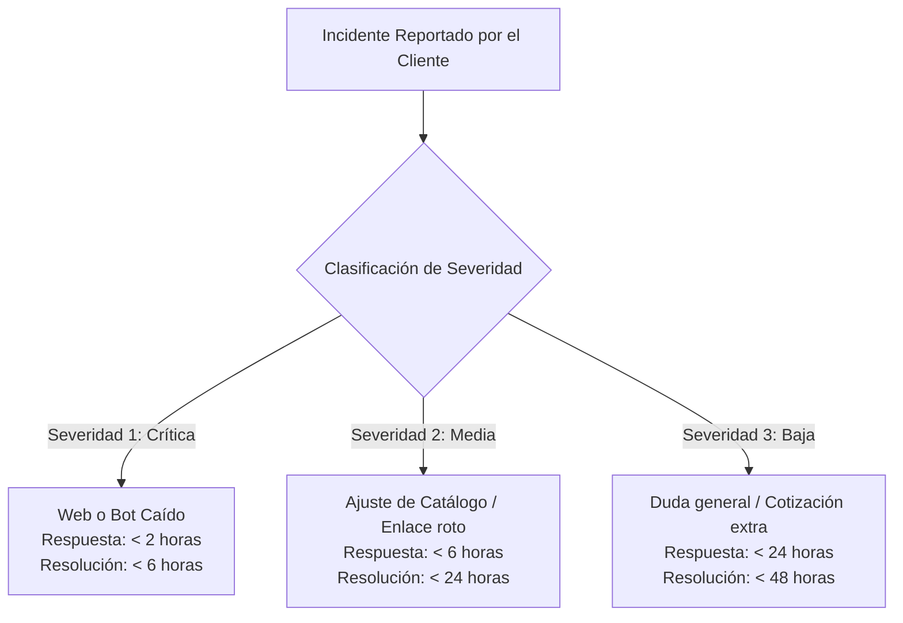
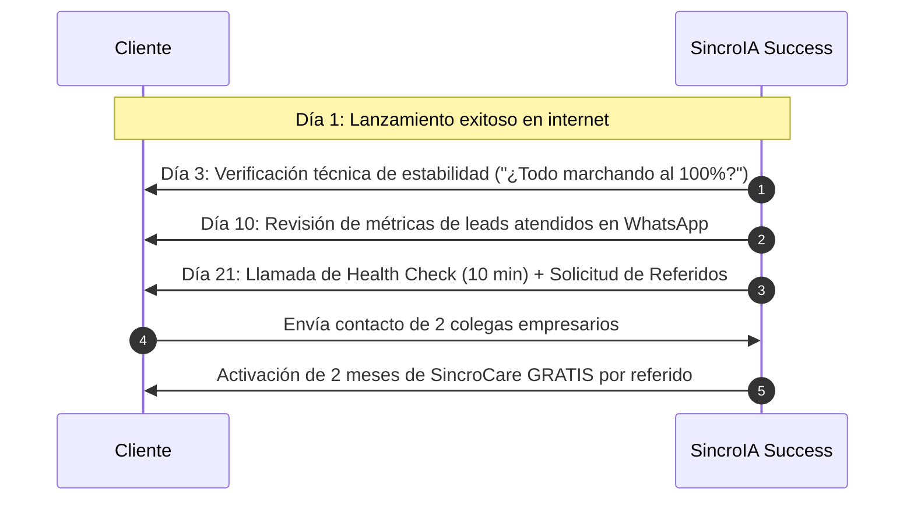
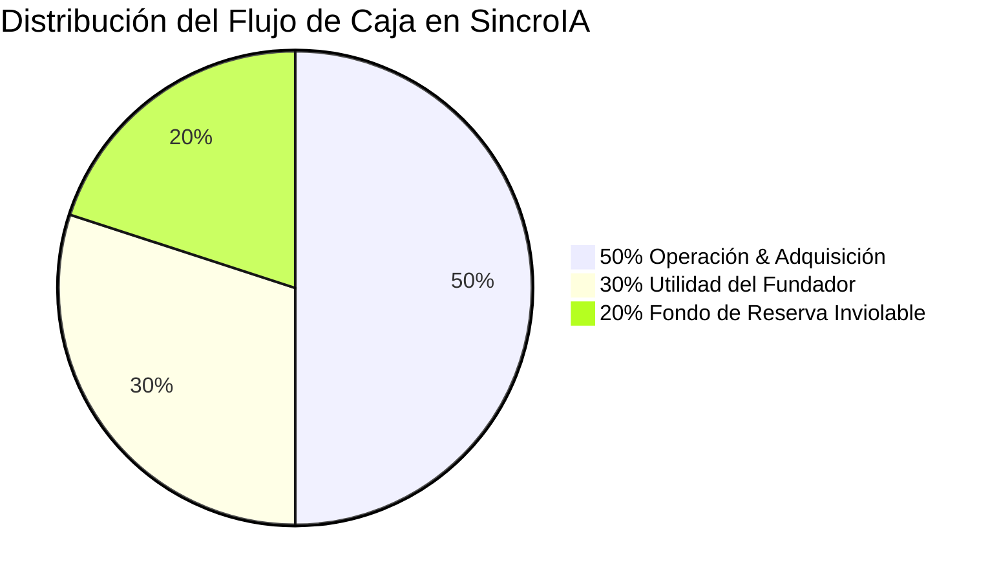

# 🛡️ MANUAL OFICIAL DE OPERACIONES, SOPORTE, SEGURIDAD Y GESTIÓN FINANCIERA
## SincroIA — Estándares Operativos y Protocolos Internos (SOP)

**Versión:** 1.0 (Oficial)  
**Clasificación:** Confidencial / Uso Interno y Operativo  
**Aplicabilidad:** SincroIA y Clientes Activos en Colombia y LATAM  

---

## ÍNDICE DE PROTOCOLOS

1. [Protocolo 1: Control de Cambios & Freno al "Scope Creep"](#protocolo-1-control-de-cambios--freno-al-scope-creep)
2. [Protocolo 2: Gestión de Incidentes & Niveles de Servicio (SLA)](#protocolo-2-gestión-de-incidentes--niveles-de-servicio-sla)
3. [Protocolo 3: Custodia y Bóveda Segura de Credenciales](#protocolo-3-custodia-y-bóveda-segura-de-credenciales)
4. [Protocolo 4: Customer Success, Health Check (Día 21) & Bucle de Referidos](#protocolo-4-customer-success-health-check-día-21--bucle-de-referidos)
5. [Protocolo 5: Gestión Administrativa, Tributaria y Flujo de Caja (50/30/20)](#protocolo-5-gestión-administrativa-tributaria-y-flujo-de-caja-503020)
6. [Protocolo 6: Línea de Ensamblaje & Boilerplate de Cliente (< 2 Horas)](#protocolo-6-línea-de-ensamblaje--boilerplate-de-cliente--2-horas)

---

## PROTOCOLO 1: CONTROL DE CAMBIOS & FRENO AL "SCOPE CREEP"

El *"Scope Creep"* (desviación o crecimiento infinito del alcance) es la principal causa de quiebra y estrés en agencias de desarrollo. Ocurre cuando el cliente solicita adiciones continuas que no estaban presupuestadas, asumiendo que "ya están incluidas".

### 1.1 Matriz de Diferenciación: Ajuste Menor vs. Módulo Adicional

| Tipo de Solicitud | Clasificación | Acción Operativa | Costo / Plazo |
|---|:---:|---|:---:|
| Corregir un error tipográfico en un texto o dirección. | ✅ **Ajuste Menor** | Se aplica dentro de la ronda de revisión. | **$0 COP** (Incluido) |
| Reemplazar una fotografía por otra de mejor calidad. | ✅ **Ajuste Menor** | Se reemplaza en menos de 24 horas. | **$0 COP** (Incluido) |
| Calibrar una respuesta del bot que sonó poco natural. | ✅ **Ajuste Menor** | Se refina el system prompt. | **$0 COP** (Incluido) |
| Agregar 30 productos más de los acordados al e-commerce. | ⚠️ **Módulo Extra** | Se cotiza paquete de carga de catálogo. | **+$250.000 COP** (+2 días) |
| Integrar pasarela de pagos cuando el plan era Web Base. | ⚠️ **Módulo Extra** | Se cotiza módulo transaccional Wompi/Bold. | **+$590.000 COP** (+3 días) |
| Conectar facturación electrónica automática DIAN. | ⚠️ **Módulo Extra** | Se cotiza módulo de facturación API. | **+$850.000 COP** (+4 días) |
| Rediseñar la estructura de secciones ya aprobadas. | ⚠️ **Módulo Extra** | Se cobra tarifa de remaquetación. | **+$450.000 COP** (+3 días) |

### 1.2 Guion Maestro para Frenar Peticiones sin Romper la Relación
Cuando un cliente solicita algo fuera de contrato, se aplica la **"Técnica del Sí Condicionado"**:

> *«¡Me parece una idea excelente para tu negocio, [Nombre]! Esa función aportará mucho valor. Como no formaba parte del paquete inicial pactado en nuestro contrato, con gusto te preparo una cotización rápida como módulo adicional por \$[Monto] COP y la programamos para la próxima semana, garantizando que el lanzamiento oficial que tenemos previsto para este [Día] no sufra ningún retraso. ¿Te preparo la propuesta?»*

* **Por qué funciona:** No dices un "NO" frustrante; validas la idea del cliente, proteges tu tiempo y creas una oportunidad inmediata de facturación extra.

---

## PROTOCOLO 2: GESTIÓN DE INCIDENTES & NIVELES DE SERVICIO (SLA)

Para clientes activos bajo el plan de continuidad **SincroCare ($190.000 COP/mes)**, la atención técnica se rige por los siguientes Acuerdos de Nivel de Servicio (SLA):

### 2.1 Niveles de Severidad y Tiempos de Respuesta

* **Severidad 1 (Crítica):** El Agente de IA no responde en WhatsApp o el portal web muestra error 500/caída.
  * **Tiempo de Respuesta Inicial:** **< 2 horas hábiles**.
  * **Tiempo Máximo de Solución:** **< 6 horas hábiles**.
* **Severidad 2 (Media):** El bot tiene desactualizado un precio de catálogo, un botón de enlace requiere cambio o se necesita ajustar un horario.
  * **Tiempo de Respuesta Inicial:** **< 6 horas hábiles**.
  * **Tiempo Máximo de Solución:** **< 24 horas hábiles**.
* **Severidad 3 (Baja / Evolutiva):** Dudas de administración, reportes mensuales de leads o solicitud de cotizaciones para nuevos módulos.
  * **Tiempo de Respuesta Inicial:** **< 24 horas hábiles**.

### 2.2 Arquitectura Dual & Procedimiento de Reconexión 24/7
Para asegurar disponibilidad ininterrumpida (99.9% Uptime) y evitar que el cliente dependa de una laptop o teléfono con batería:

1. **Estándar Corporativo (Meta Cloud API Oficial):**
   - Configuración nativa por Webhooks directos con los servidores de Meta.
   - **Cero teléfonos encendidos, cero códigos QR y cero riesgo de caídas por batería o wifi.**
   - Aplicable a clientes de planes Agente IA Pro, E-commerce Pro y Ecosistema Total.
2. **Estándar Chip Físico (Contenedor Docker Cloud con Watchdog de Salud):**
   - Para números físicos preexistentes, la sesión corre en un contenedor Docker con persistencia SSD y Redis en la nube (Railway/VPS).
   - Si la sesión reporta estado `connection: close`, el **Watchdog de Salud** dispara una alerta automática e inmediata a Telegram de SincroIA y genera un enlace seguro de re-escaneo para el cliente.
   - Para el procedimiento paso a paso de aprovisionamiento, consultar [**`docs/ARQUITECTURA_FARM_CLIENTES_BOILERPLATE.md`**](./ARQUITECTURA_FARM_CLIENTES_BOILERPLATE.md).

---

## PROTOCOLO 3: CUSTODIA Y BÓVEDA SEGURA DE CREDENCIALES

SincroIA administra llaves de acceso críticas de empresas terceras (DNS, pasarelas de pago, software contable y líneas de WhatsApp). La custodia de estos activos debe ser impenetrable:

### 3.1 Reglas de Seguridad Inquebrantables
1. **Prohibido WhatsApp para Contraseñas:** Queda terminantemente prohibido almacenar contraseñas de clientes en conversaciones de WhatsApp, notas del celular o archivos de Word sin cifrar.
2. **Uso de Bóveda Cifrada:** Toda credencial se almacena en un gestor cifrado con autenticación de dos factores (2FA) como **Bitwarden** o **1Password**.
3. **Principio de Mínimo Privilegio:** 
   * Para pasarelas de pago (Wompi, Bold), se solicitan exclusivamente las **Llaves API de Integración** (pública y privada). **Nunca** se solicita el usuario y contraseña bancaria del portal financiero del cliente.
   * Para dominios (GoDaddy, Namecheap), se solicita acceso mediante invitación de "Usuario Delegado / Técnico", sin acceso a los métodos de facturación del cliente.

### 3.2 Protocolo de Cierre y Limpieza de Accesos (Offboarding)
Al concluir un proyecto:
* Se entrega al cliente el archivo de credenciales técnicas definitivo.
* Se le instruye por escrito para cambiar contraseñas temporales que haya suministrado.
* SincroIA conserva únicamente las llaves estrictamente necesarias para el mantenimiento del bot en SincroCare.

---

## PROTOCOLO 4: CUSTOMER SUCCESS, HEALTH CHECK (DÍA 21) & BUCLE DE REFERIDOS

El costo de adquisición de un cliente nuevo es 5 veces mayor que retener a uno existente. Este protocolo transforma a los clientes satisfechos en una **fuente inagotable de clientes nuevos a costo $0**.

### 4.1 La Llamada de "Health Check" (Día 21)
A las tres semanas de operación, se agenda una llamada de 10 minutos con el dueño del negocio:
1. *«[Nombre], llamo para revisar cómo te ha ido en estas tres semanas con el bot y la web. ¿Cuántas citas o consultas han cerrado en horarios no laborales?»*
2. Escuchar activamente sus métricas y celebrar sus resultados.
3. Si requiere algún ajuste fino de respuestas, se aplica en el acto.

### 4.2 El Programa de Referidos "SincroPartners"
Inmediatamente tras validar que el cliente está contento, se lanza la propuesta:
> *«[Nombre], nos alegra muchísimo ver cómo la IA te ha ahorrado horas de trabajo y recuperado ventas. En SincroIA crecemos por recomendación de clientes satisfechos como tú.*  
> *Tenemos un programa de aliados muy simple: si nos presentas con un empresario o colega amigo que implemente cualquiera de nuestros planes, **te acreditamos 2 meses de SincroCare 100% GRATIS (\$380.000 COP de ahorro directo)** o te transferimos una comisión del 10% en efectivo sobre el valor del proyecto.*  
> *¿Qué dos amigos tienes que estén sufriendo por demoras en WhatsApp o tengan una página web lenta?»*

* **Tasa observada:** **1 de cada 3 clientes te entrega al menos 2 contactos directos**. Al ser una recomendación "de dueño a dueño", la tasa de cierre supera el 50%.

---

## PROTOCOLO 5: GESTIÓN ADMINISTRATIVA, TRIBUTARIA Y FLUJO DE CAJA (50/30/20)

Para garantizar solvencia patrimonial y cumplimiento legal en Colombia:

### 5.1 Formalidad Legal y Tributaria (DIAN)
* **Actividades Económicas en el RUT (Registro Único Tributario):**
  * **CIIU Principal: 6201** — *Desarrollo de sistemas informáticos (planificación, análisis, diseño, programación y pruebas).*
  * **CIIU Secundario: 6202** — *Actividades de consultoría informática y administración de instalaciones informáticas.*
* **Régimen Tributario:**
  * Facturación electrónica mediante software habilitado (Siigo / Factus / Alegra) o Cuenta de Cobro con documento soporte electrónico para clientes no obligados a facturar.
  * Cumplimiento de retenciones en la fuente correspondientes según el tipo societario del cliente contratante.

### 5.2 La Regla de Oro del Flujo de Caja (50 / 30 / 20)
De cada pago recibido por proyectos o mensualidades de SincroCare, los fondos se dividen automáticamente en tres cuentas bancarias o "bolsillos" digitales:

1. **50% — Operación, Infraestructura & Adquisición:**
   * Pago de servidores cloud (Vercel, Railway, Render).
   * Bolsa de consumo de APIs de IA (Google Gemini API).
   * **Presupuesto sagrado de publicidad:** Inversión de \$20.000 a \$30.000 COP diarios en Meta Ads para mantener el embudo lleno de nuevos prospectos.
2. **30% — Utilidad Neta & Honorarios del Fundador:**
   * Remuneración por dirección ejecutiva y distribución de utilidades de la empresa.
3. **20% — Fondo de Reserva Inviolable (Caja de Seguridad):**
   * Se deposita en una cuenta de ahorros de alto rendimiento (Nu, Lulo, Rendimientos fiduciarios).
   * **Propósito exclusivo:** Acumular un colchón equivalente a **tres (3) meses de costos fijos de la agencia** para amortiguar cualquier eventualidad de mercado o temporada baja sin comprometer la operación.

### 5.3 Procedimiento de Cobranza Recurrente Amigable & Reporte de ROI
Para evitar la fricción de cobro manual y asegurar pagos puntuales:
* **Día -5 (Día 25):** Envío obligatorio del **Reporte de Impacto Ejecutivo (Día 28)** demostrando métricas de chats atendidos, leads calificados y ahorro en nómina.
* **Día 0 (Fecha de Corte):** Emisión de la cuenta de cobro digital con enlace de pago directo en un clic (Wompi/Bold - tarjetas, PSE, Nequi).
* **Día +3 (Recordatorio Amigable):** Mensaje cordial por WhatsApp en tono de socio tecnológico.
* **Día +5 (Modo Pausa Preventivo):** Para no asumir costos de servidores impagos, la línea entra en respuesta de cortesía institucional temporal.
* **Plantilla y guiones completos:** Consultar la guía oficial en [**`docs/PLANTILLA_REPORTE_IMPACTO_SINCROCARE.md`**](./PLANTILLA_REPORTE_IMPACTO_SINCROCARE.md).

---

## PROTOCOLO 6: LÍNEA DE ENSAMBLAJE & BOILERPLATE DE CLIENTE (< 2 HORAS)

Para garantizar que un nuevo proyecto se entregue en 5 a 7 días hábiles manteniendo márgenes superiores al 85%, el desarrollo técnico sigue una línea de montaje estandarizada:

### 6.1 Repositorio Modular y Configuración Parametrizada
Todo proyecto de cliente se basa en el template maestro **`sincro-client-starter`**.
* La personalización de colores, logo, catálogo, preguntas frecuentes y reglas del agente no se programa desde cero; se parametriza en el archivo maestro **`templates/client.config.template.json`**.
* El ingeniero de SincroIA únicamente clona el repositorio base, vuelca los insumos del formulario de onboarding en el archivo JSON y ejecuta el despliegue en Vercel.

### 6.2 Flujo de Aprovisionamiento en 45 Minutos
1. **Fork del Boilerplate:** Creación del repositorio privado para el cliente.
2. **Carga de Datos:** Reemplazo de `client.json` con catálogo y reglas de negocio.
3. **Conexión de WhatsApp:**
   - **Meta Cloud API Oficial:** Vinculación directa por Webhook HTTPS a los servidores de Meta (cero celulares físicos).
   - **Evolution API Cloud Docker:** Para números físicos, conexión a contenedor con Redis y Watchdog de salud.
4. **Despliegue Edge en Vercel:** Compilación y asignación de dominio personalizado en menos de 60 segundos.
5. Para especificaciones de arquitectura y diagramas, consultar [**`docs/ARQUITECTURA_FARM_CLIENTES_BOILERPLATE.md`**](./ARQUITECTURA_FARM_CLIENTES_BOILERPLATE.md).

---

*Este manual forma parte del compendio operativo estándar de SincroIA y debe ser revisado trimestralmente para optimizaciones de proceso.*
