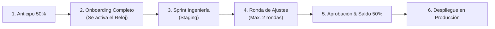

# PROPUESTA TÉCNICO-COMERCIAL & ESPECIFICACIÓN DE PROYECTO
## SINCROIA.LAT — INGENIERÍA DIGITAL & SISTEMAS DE CONVERSIÓN 24/7

**Código de Propuesta:** `SINCRO-2026-` `[AÑO][MES]-[NÚMERO]`  
**Fecha de Emisión:** `[FECHA DE EMISIÓN, Ej: 23 de Septiembre de 2026]`  
**Vigencia de la Oferta:** 10 días calendario *(Vencido el plazo, SincroIA podrá actualizar disponibilidad técnica, cronograma y valores)*  
**Empresa / Cliente:** `[NOMBRE DEL CLIENTE / RAZÓN SOCIAL]`  
**NIT / C.C.:** `[NÚMERO DE IDENTIFICACIÓN FISCAL]`  
**Contacto Principal:** `[NOMBRE Y CARGO DEL CONTACTO]`  
**Líder Técnico SincroIA:** Ing. Alejandro Lamus — Director de Ingeniería (`contacto@sincroia.lat` | `+57 312 463 0488`)

---

## 01. RESUMEN EJECUTIVO & PRINCIPIO DE TRANSPARENCIA
En SincroIA operamos bajo una filosofía estricta de ingeniería: **valor comercial medible antes que tecnología abstracta y transparencia radical en el alcance**. 

Este documento establece con precisión milimétrica los problemas de su negocio que resolveremos, la arquitectura técnica que implementaremos, qué incluye y qué **NO** incluye el proyecto, los criterios formales para darlo por entregado a satisfacción y el modelo de continuidad operativa.

---

## 02. DIAGNÓSTICO CONSULTIVO
Con base en las sesiones de análisis previas sobre los canales digitales y comerciales de **`[EMPRESA CLIENTE]`**, se han identificado las siguientes fricciones críticas:

* 🔴 **Fuga de Prospectos fuera de horario:** Mensajes de clientes potenciales recibidos en las noches, fines de semana o festivos que no reciben atención inmediata y acuden a la competencia.
* 🔴 **Demoras en Tiempos de Respuesta Manual:** Tiempos de primera respuesta superiores a 15–30 minutos durante el horario laboral, reduciendo el retorno de inversión publicitaria.
* 🔴 **Fricción en Conversión Web:** Presencia digital con tiempos de carga elevados, interfaces no optimizadas para dispositivos móviles o dependencia de constructores visuales lentos que incrementan la tasa de rebote.
* 🔴 **Carga Operativa Repetitiva:** Personal humano dedicando entre el 60% y 70% de su tiempo a responder las mismas preguntas frecuentes, consultas de catálogo o agendamiento manual.

---

## 03. OBJETIVOS E IMPACTO ESPERADO (MÉTRICAS CLAVE)
La intervención tecnológica tiene como propósito transformar su infraestructura comercial mediante metas operativas concretas:

| Indicador Clave (KPI) | Estado Típico Inicial | Objetivo Técnico con SincroIA |
| :--- | :--- | :--- |
| **Tiempo de Primera Respuesta** | 15 a 120 minutos (o al día siguiente) | **< 2 segundos** (condiciones estándar) |
| **Disponibilidad Comercial** | 8 a 9 horas / día (Lunes a Viernes) | **24 horas / 7 días / 365 días al año** |
| **Velocidad de Carga Web Móvil** | 3.5 a 6.0 segundos (WordPress/Elementor) | **Objetivo Edge < 0.8s - 1.2s** (Next.js) |
| **Calificación y Filtro de Leads** | Manual y desestructurada | **Automática en tiempo real con ficha ejecutiva** |
| **Retención de Oportunidades** | Pérdida estimada del 30% al 45% de leads | **100% de consultas atendidas y registradas** |

---

## 04. SOLUCIÓN PROPUESTA & ARQUITECTURA TÉCNICA
Se proyecta una arquitectura desacoplada, moderna y de nivel empresarial sin ataduras a plataformas cautivas:

* **Frontend & Web:** Código nativo en **Next.js 15** (React 19, TypeScript, Tailwind CSS) alojado en la red global Anycast Edge de **Vercel** con disponibilidad objetivo del 99.9%.
* **Motor de Inteligencia Artificial:** Orquestación y contextualización mediante modelos **Gemini Flash** con guardarraíles deterministas de venta consultiva, memoria de contexto multi-turno y detección semántica de intención de compra.
* **Integración WhatsApp:** Conexión continua a su línea comercial con protocolo de **Relevo Humano** (silenciado automático ante intervención de un asesor).
* **Gestión de Prospectos:** Sistema automatizado de captura y centralización de leads conectado en tiempo real a Google Workspace (Google Sheets CRM) y alertas instantáneas a Telegram/Correo.

---

## 05. ALCANCE ESPECÍFICO & ENTREGABLES EXACTOS

> *(Marcar el plan acordado y suprimir los restantes para la versión final del cliente)*

### [ ] OPCIÓN 1: AGENTE DE IA COMERCIAL PRO 24/7 (WhatsApp)
* **Inversión:** $2.490.000 COP (Pago único de implementación)
* **Tiempo de Entrega:** 7 a 10 días hábiles (a partir de insumos completos).
* **Entregables Concretos:**
  1. **Contextualización & Guardarraíles:** Configuración del agente con hasta 50 productos/servicios, precios oficiales, políticas de envío/garantía y preguntas frecuentes (FAQs).
  2. **Conexión a Línea de WhatsApp:** Vinculación a 1 número comercial provisto por el cliente.
  3. **Módulo de Calificación & Agendamiento:** Detección de necesidad, presupuesto y enlace sincronizado con Google Calendar.
  4. **Protocolo de Relevo Humano:** El bot entra en pausa preventiva de 45 minutos cuando un asesor humano interviene o mediante comando `#bot`.
  5. **Ficha Ejecutiva de Oportunidades:** Alerta instantánea vía Telegram/WhatsApp al celular del líder comercial cuando un cliente califica para compra inmediata.
  6. **Sistema de Trazabilidad:** Conexión de cada conversación calificada a una hoja centralizada en Google Workspace.
  7. **Mes de Cortesía SincroCare:** 30 días calendario de servidor cloud 24/7 y bolsa estándar de hasta 2.500 mensajes de IA incluidos.

---

### [ ] OPCIÓN 2: WEB COMERCIAL DE ALTO RENDIMIENTO (Next.js 15)
* **Inversión:** $1.890.000 COP (Pago único de implementación)
* **Tiempo de Entrega:** 5 a 7 días hábiles (a partir de insumos completos).
* **Entregables Concretos:**
  1. **Desarrollo en Código Nativo:** Hasta 5 secciones estratégicas de alto impacto (Hero con propuesta de valor, Servicios/Soluciones, Diferenciales, Casos/Testimonios, Formulario de Captación).
  2. **Optimización de Rendimiento:** Arquitectura Mobile-First orientada a métricas PageSpeed 90+ bajo condiciones estándar de medición (Lighthouse móvil sobre página principal en producción).
  3. **Infraestructura Anual Incluida:** Registro de dominio `.com` o `.co` por 1 año, certificado de seguridad SSL HTTPS y despliegue en Vercel Edge.
  4. **Captura Automatizada de Leads:** Formulario validado con protección antispam y despacho automático a CRM (Google Workspace) y notificaciones instantáneas.
  5. **Botón Flotante Inteligente:** Enlace directo de conversión a WhatsApp con mensaje contextual predeterminado.
  6. **Entrega de Código Fuente:** Entrega del repositorio específico del proyecto desarrollado para el cliente.

---

### [ ] OPCIÓN 3: E-COMMERCE TRANSACCIONAL PRO
* **Inversión:** $3.690.000 COP (Pago único de implementación)
* **Tiempo de Entrega:** 12 a 15 días hábiles (a partir de insumos completos).
* **Entregables Concretos:**
  1. Catálogo estructurado para hasta 50 productos con soporte para variantes (tallas, colores, atributos).
  2. Integración de pasarelas de pago colombianas (Wompi / Bold / Mercado Pago / PSE / Tarjetas).
  3. Panel administrativo intuitivo para actualización de inventario, precios y visualización de pedidos.
  4. Módulo de cálculo de fletes/envíos configurable por zonas.
  5. Notificaciones transaccionales automáticas al comprador vía correo electrónico.

---

### [ ] OPCIÓN 4: ECOSISTEMA TOTAL SINCROIA (Sistema Comercial Integral)
* **Inversión:** **$4.890.000 COP** (Pago único de implementación)
* **Ahorro Real Documentado:** **$700.000 COP** frente a contratación modular separada:
  * *Web Comercial de Alto Rendimiento ($1.890.000 COP)*
  * *Agente de IA Comercial Pro 24/7 ($2.490.000 COP)*
  * *Módulo Transaccional / Cotizador Dinámico Interactivo ($1.210.000 COP)*
  * *Valor Contratación Individual:* **$5.590.000 COP** ➔ **Inversión en Ecosistema: $4.890.000 COP** *(Ahorro exacto de $700.000 COP)*.
* **Tiempo de Entrega:** 14 a 18 días hábiles.
* **Entregables Concretos:** La integración completa de la Web Comercial y el Agente de IA para WhatsApp, interactuando sobre una misma base de datos de prospectos y sincronizados en tiempo real.

---

## 06. EXCLUSIONES Y LÍMITES DE ALCANCE (LO QUE NO ESTÁ INCLUIDO)
Para garantizar la predictibilidad del proyecto y evitar sobrecostos, se definen taxativamente las siguientes exclusiones:

1. **Creación y Producción de Contenidos:** Redacción de textos definitivos no suministrados, fotografía profesional de productos, diseño o rediseño de identidad corporativa (logos, manuales de marca) o producción audiovisual.
2. **Costos y Licencias de Plataformas de Terceros:** Tarifas por conversación de Meta Cloud API / WhatsApp (si el cliente opta por la API oficial empresarial de Meta), suscripciones a software contable externo (ej: Siigo, Alegra), pasarelas de pago o dominios premium.
3. **Campañas Publicitarias y Gestión de Tráfico:** SincroIA entrega la infraestructura técnica optimizada para conversión; la configuración, gestión o presupuesto de anuncios en Meta Ads o Google Ads es responsabilidad del cliente o su agencia de pauta.
4. **Desarrollos Adicionales Post-Aprobación:** Cualquier funcionalidad, pantalla, integración con ERP/CRM de terceros o módulo que no se encuentre expresamente detallado en la Sección 05.
5. **Soporte Presencial y Mantenimiento Evolutivo:** Todo el soporte se presta de forma remota. Modificaciones periódicas de catálogo fuera del periodo de garantía se gestionan mediante SincroCare.

---

## 07. CRITERIOS DE ACEPTACIÓN FORMAL & DEFINICIÓN DE BUG VS. CAMBIO
Para delimitar con rigor técnico la finalización del proyecto:

### A. Criterios de Aceptación Funcional (Staging):
El proyecto se considerará formalmente terminado y apto para su paso a producción cuando:
* Todos los entregables especificados en la Sección 05 se encuentren desplegados en el entorno de pruebas (Staging).
* Los flujos de conversación del agente o formularios web procesen la información y ejecuten los disparos acordados.
* No existan **errores críticos bloqueantes** que impidan la operación comercial normal del sistema.
* Se hayan completado las revisiones acordadas dentro de los plazos establecidos.
* *Nota Técnica:* Las diferencias de preferencia estética subjetiva (ej: "un tono de azul más claro", "mover un texto 2 milímetros") o cambios de opinión sobre contenidos previamente aprobados **no constituyen fallas funcionales**.

### B. Distinción Rigurosa: Bug vs. Cambio de Alcance
* 🟢 **Error / Incidencia (Bug - Cubierto sin costo):** Se define como un comportamiento del software o del agente que desvíe su operación de las especificaciones pactadas en esta propuesta (ej: un formulario que no envíe los datos, un enlace roto, una respuesta del bot que se congele).
* 🔵 **Cambio de Alcance (Requerimiento Nuevo - Cotizable aparte):** Cualquier solicitud que añada campos nuevos, modifique la lógica comercial aprobada, incorpore productos adicionales o integre sistemas no previstos inicialmente.

---

## 08. CRONOGRAMA, RESPONSABILIDAD DEL CLIENTE & "EL RELOJ DEL CLIENTE"

* **Activación del Cronómetro ("El Reloj del Cliente"):** Los plazos de entrega en días hábiles pactados comenzarán a computarse **a partir del día hábil siguiente a la entrega completa del Formulario de Onboarding y la totalidad de insumos obligatorios** (logo, catálogo con precios definitivos y accesos técnicos).
* **Demoras del Cliente:** Si el cliente presenta retrasos en el suministro de insumos, respuestas o aprobaciones, el cronograma quedará suspendido automáticamente por el mismo número de días de demora, sin que ello constituya penalidad ni retraso atribuible a SincroIA.
* **Procedimiento de Revisión:** Una vez entregado el entorno de Staging, el cliente contará con **cinco (5) días hábiles** para consolidar y remitir por escrito sus observaciones. La propuesta incluye hasta **dos (2) rondas de ajustes menores** dentro del alcance original. Transcurridos 5 días hábiles sin observaciones formales, operará la **aceptación tácita** del proyecto.

---

## 09. MODELO ECONÓMICO & CONDICIONES DE PAGO (REGLA 50/50)

| Concepto Comercial | Monto Oficial ($ COP) |
| :--- | :--- |
| **Inversión Total de Implementación** | **$`[VALOR TOTAL]` COP** |
| **Anticipo Indispensable para Inicio de Ingeniería (50%)** | **$`[VALOR ANTICIPO 50%]` COP** |
| **Saldo Final contra Demostración en Staging (50%)** | **$`[VALOR SALDO 50%]` COP** |

* **Hito 1 (Anticipo 50%):** Requisito previo obligatorio para reservar cupo de ingeniería, asignar infraestructura e iniciar desarrollo.
* **Hito 2 (Saldo 50%):** Pagadero una vez culminadas las revisiones en Staging a entera satisfacción y de forma previa y obligatoria al apuntamiento del dominio definitivo, entrega de credenciales o puesta en producción.
* **Canales Oficiales de Pago:**
  * **Banco:** Bancolombia — Cuenta de Ahorros N° `031-852963-04`
  * **Titular:** SincroIA.lat S.A.S. (o a nombre de Alejandro Lamus según corresponda)
  * **NIT / C.C.:** `[NÚMERO DE IDENTIFICACIÓN]`
  * **Medios Digitales:** Disponible enlace para pago con Tarjeta de Crédito / PSE / Wompi.

---

## 10. CONTINUIDAD OPERATIVA: SINCROCARE & COSTOS RECURRENTES
A diferencia de agencias que abandonan el software tras la entrega, SincroIA ofrece un modelo de continuidad operativa para garantizar que la infraestructura nunca se caiga y se mantenga actualizada:

* **Primer Mes de Cortesía (Garantizado):** Todos los planes con Agente de IA o Web incluyen **treinta (30) días calendario de servidor cloud 24/7 y monitoreo técnico sin costo adicional** tras el pase a producción.
* **Planes de Continuidad a partir del Mes 2 (Opcionales y sin permanencia forzosa):**
  * 🔹 **SincroCare Starter ($190.000 COP/mes):** Hosting Edge / servidor cloud 24/7, monitoreo de disponibilidad, bolsa de hasta 5.000 mensajes de IA mensuales, backups periódicos y 1 actualización menor de catálogo mensual.
  * 🔹 **SincroCare Growth ($350.000 COP/mes):** Hasta 20.000 mensajes de IA mensuales, soporte técnico prioritario en < 4 horas hábiles y 2 actualizaciones mensuales de catálogo/precios.
* **Libertad de Autogestión:** Si el cliente decide no renovar SincroCare, se le facilitará la entrega de documentación y credenciales para que asuma directamente los costos de sus servidores y proveedores cloud sin penalizaciones ni bloqueos.

---

## 11. GARANTÍA TÉCNICA
* SincroIA otorga una **Garantía Técnica de treinta (30) días calendario** posteriores a la puesta en producción definitiva.
* **Cobertura:** Corrección sin costo alguno de cualquier error o mal funcionamiento (Bug) directamente atribuible a la programación realizada dentro del alcance original convenido.
* **Exclusiones de Garantía:** Modificaciones de código realizadas por terceros o por el cliente, fallas masivas o caídas globales de proveedores externos (Meta, Vercel, Google), cambios imprevistos en APIs externas ajenas al control de SincroIA o incompatibilidad por falta de pago del cliente a proveedores de dominios o servidores.

---

## 12. PROPIEDAD INTELECTUAL, DATOS & CONFIDENCIALIDAD
* **Propiedad del Entregable:** Una vez cancelado el 100% del valor pactado, el cliente es **titular exclusivo de los contenidos, bases de datos de clientes capturados, catálogo y el código fuente específico** desarrollado para su empresa.
* **Know-How de SincroIA:** SincroIA retiene la titularidad moral y patrimonial sobre sus herramientas preexistentes, librerías base, prompts propietarios genéricos y metodologías de ingeniería.
* **Propiedad y Privacidad de los Datos:** Todos los datos personales, números de contacto, leads y conversaciones generadas por los usuarios pertenecen de forma privativa al cliente. En cumplimiento de la **Ley 1581 de 2012 de Habeas Data**, SincroIA actúa exclusivamente como encargado técnico y no comercializa, transfiere ni utiliza los datos del cliente para fines ajenos al contrato.
* **Confidencialidad:** Ambas partes acuerdan mantener bajo estricta reserva toda información técnica, financiera o comercial intercambiada durante la ejecución del proyecto.

---

## 13. DEPENDENCIAS DE PLATAFORMAS DE TERCEROS & LÍMITES DE IA
* **Infraestructura Externa:** El cliente reconoce que las soluciones operan sobre infraestructura provista por terceros líderes en la industria (WhatsApp / Meta Platforms, Google Cloud, Vercel Inc.). SincroIA garantiza la correcta integración y guardarraíles técnicos, pero no ejerce control societario sobre dichas entidades ni asume responsabilidad por interrupciones ajenas a sus sistemas.
* **Naturaleza de la Inteligencia Artificial:** El agente de IA opera con base en modelos de lenguaje natural contextualizados sobre la información del cliente. Debido a la naturaleza probabilística de la tecnología, SincroIA implementa restricciones estrictas, filtros de seguridad y el protocolo de **Relevo Humano** para que un asesor intervenga ante cualquier duda no tipificada.

---

## 14. POLÍTICA DE SUSPENSIÓN Y DESISTIMIENTO
* **Desistimiento Unilateral:** Si el cliente decide cancelar el proyecto una vez iniciado el desarrollo técnico, el anticipo del 50% no será reembolsable, compensando las horas de arquitectura, ingeniería y reserva de capacidad técnica devengadas por SincroIA.
* **Pausa del Proyecto:** Si el proyecto queda en pausa por más de treinta (30) días debido a inactividad o falta de insumos por parte del cliente, SincroIA podrá reprogramar la fecha de entrega según la disponibilidad de cupos de ingeniería al momento de su reactivación.

---

## 15. ACEPTACIÓN & VALIDEZ LEGAL DIGITAL
De conformidad con la legislación colombiana (Ley 527 de 1999 sobre Comercio Electrónico y Mensajes de Datos):
> *La aceptación de la presente propuesta podrá realizarse mediante firma física, firma electrónica o confirmación expresa por medios electrónicos (correo electrónico o WhatsApp oficial), acompañada del comprobante de transferencia correspondiente al anticipo del 50% y copia del RUT de la empresa.*

Una vez formalizada la aceptación y efectuado el pago del anticipo, la presente propuesta y el **Contrato Marco de Prestación de Servicios de SincroIA** constituirán el acuerdo integral vinculante entre las partes.

---

### ACEPTACIÓN FORMAL DE LA PROPUESTA:

| POR SINCROIA.LAT | POR EL CLIENTE CONTRATANTE |
| :--- | :--- |
| **Ing. Alejandro Lamus** | **Nombre:** `[NOMBRE REPRESENTANTE LEGAL]` |
| Director de Ingeniería & Operaciones | **C.C. / NIT:** `[NÚMERO DE IDENTIFICACIÓN]` |
| Firma: ________________________________ | Firma: ________________________________ |
| Fecha: `[FECHA DE ACEPTACIÓN]` | Fecha: `[FECHA DE ACEPTACIÓN]` |
