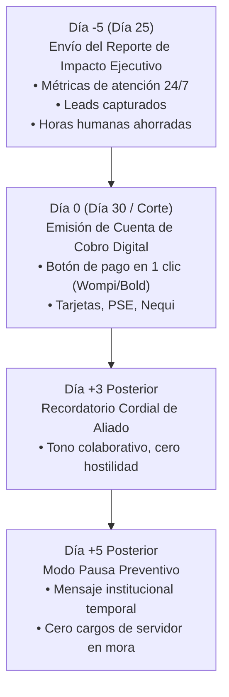

# 📊 PLANTILLA OFICIAL: REPORTE DE IMPACTO MENSUAL & COBRANZA AMIGABLE
## SincroCare — Retención, Demostración de ROI y Ciclo de Facturación

Este documento establece el procedimiento operativo estandarizado para la **retención activa de clientes en SincroCare** mediante la entrega del **Reporte de Impacto del Día 28**, eliminando la fricción de cobranza y demostrando el retorno sobre la inversión (ROI) antes de emitir cada factura.

---

## 1. EL PRINCIPIO FUNDAMENTAL: "VALOR ANTES DEL COBRO"

> **Regla de Oro de SincroCare:**  
> Jamás se envía una cuenta de cobro sin antes recordarle al cliente cuánto dinero y tiempo le ahorró su Agente de IA.  
> Un cliente al que se le cobra $190.000 COP a secas puede dudar; un cliente que ve que la IA atendió a 400 prospectos y le ahorró $850.000 COP en nómina, **paga inmediatamente y con gratitud**.

---

## 2. CALENDARIO OFICIAL DEL CICLO DE FACTURACIÓN AMIGABLE

El ciclo se programa según la **fecha de corte mensual** de cada cliente (día en que se puso en producción el proyecto):



---

## 3. PLANTILLA DEL REPORTE DE IMPACTO (DÍA 28)

Este mensaje se envía directamente al WhatsApp del dueño o decisor de la empresa 2 a 3 días antes de la fecha de corte:

```text
📊 *Reporte Mensual de Rendimiento — [NOMBRE DE LA EMPRESA]*
Periodo: [01 de Mes] al [28 de Mes]

¡Hola [Nombre del Dueño]! 👋 Te compartimos el balance operativo de tu Agente de IA durante este ciclo:

⚡ *1. Métricas de Atención y Velocidad:*
• Total de conversaciones atendidas: *[XXX] prospectos*
• Tiempo de respuesta promedio: *< 2 segundos*
• Consultas resueltas de forma 100% autónoma: *[XX]%*

🌙 *2. Ventas y Atención Fuera de Horario:*
• Prospectos atendidos en noches (6:00 PM a 8:00 AM) y domingos: *[XX] clientes*
• _(Clientes que tu competencia habría capturado por demora en responder)._

🎯 *3. Conversión al Pipeline Comercial:*
• Leads calificados enviados a tu CRM / Telegram: *[XX] prospectos con presupuesto validado*
• Citas agendadas / Cotizaciones entregadas: *[XX]*

💰 *4. Retorno de Inversión (ROI Estimado):*
• Horas de atención humana automatizadas: *~[XX] horas*
• Ahorro equivalente en nómina de atención básica: *~$[XXX.000] COP*
• Tu inversión en continuidad SincroCare: *Solo $[XXX.000] COP*
📈 *Retorno generado para tu negocio:* *~[X.X]x tu inversión*

---
Tu infraestructura cloud, servidor 24/7 y bolsa de tokens de IA están garantizados hasta el próximo *[Fecha de Corte]*.

En 48 horas recibirás el enlace para la renovación de tu ciclo mensual. ¡Gracias por confiar en SincroIA como tu brazo tecnológico! 🚀
```

---

## 4. MENSAJES OFICIALES DEL CICLO DE FACTURACIÓN

### A. Día de Corte (Envío de Factura Digital):
```text
¡Hola [Nombre]! 🚀

Adjuntamos la cuenta de cobro digital correspondiente al nuevo ciclo de *SincroCare [Starter / Growth / Enterprise]* para el periodo [Mes - Año].

💳 *Monto a cancelar:* $[190.000 / 350.000 / 590.000] COP
📅 *Fecha límite oportuna:* [Fecha en 3 días]

Puedes realizar el pago en 1 clic de forma segura vía PSE, Tarjeta de Crédito o Nequi a través de nuestro botón oficial:
👉 [ENLACE DE PAGO WOMPI / BOLD]

Apenas realices el pago, nuestro sistema conciliará y renovará automáticamente tu servidor por 30 días adicionales. ¡Seguimos trabajando para ti!
```

### B. Día +3 Posterior (Recordatorio Cordial de Aliado):
```text
Hola [Nombre], qué gusto saludarte 👋

Te escribimos para recordarte que la renovación del ciclo de SincroCare de *[Nombre Empresa]* se encuentra pendiente de pago.

Sabemos el día a día tan ocupado que tienes, así que te dejamos nuevamente el enlace directo para cancelarlo en 30 segundos:
👉 [ENLACE DE PAGO WOMPI / BOLD]

¿Requieres que te apoyemos con alguna factura electrónica adicional o medio de pago especial para tu empresa? Quedamos atentos.
```

### C. Día +5 Posterior (Activación de "Modo Pausa Preventivo"):
> **Regla de Operación:** Nunca se "apaga" el bot dejando la línea en silencio absoluto, porque los clientes del negocio pensarían que la empresa quebró o no existe.  
> En su lugar, el bot entra en **Modo Cortesía Institucional**:

* **Respuesta automática que emite el bot a los clientes del negocio:**  
  *`"¡Hola! Nuestro canal de atención automatizada se encuentra en actualización técnica programada en este momento. Para consultas urgentes o pedidos, por favor comunícate directamente con nuestro equipo al [TELÉFONO O CORREO DE RESPALDO DEL CLIENTE]. ¡Disculpa las molestias!"`*

* **Notificación privada que SincroIA envía al dueño de la empresa:**
```text
⚠️ *Aviso de Continuidad Operativa — SincroCare*

Hola [Nombre], te informamos que la instancia de tu Agente de IA ha entrado en *Modo Pausa Temporal* debido a que registramos un saldo pendiente de renovación.

Durante esta pausa, la línea responderá con un mensaje de cortesía indicando que el canal está en actualización para proteger la imagen de tu empresa.

Para reactivar el asistente con su catálogo completo y atención 24/7 en menos de 5 minutos, puedes ponerte al día en el siguiente enlace:
👉 [ENLACE DE PAGO DIRECTO]

Apenas se confirme la transacción, tu servidor se restablecerá automáticamente al 100%.
```

---

## 5. REPORTE DE RECALIBRACIÓN MENSUAL (VALOR AÑADIDO)

Para clientes de **Tier Growth ($350K)** y **Tier Enterprise ($590K)**, el reporte incluye una sesión de 15 minutos o formulario de actualización:
* "¿Lanzaron nuevos productos este mes?"
* "¿Cambiaron los precios o promociones?"
* "¿Hay alguna objeción recurrente de los clientes que la IA deba responder mejor?"

Esto convierte a SincroCare en un servicio de **consultoría viva** que ningún competidor de bots baratos puede igualar.
