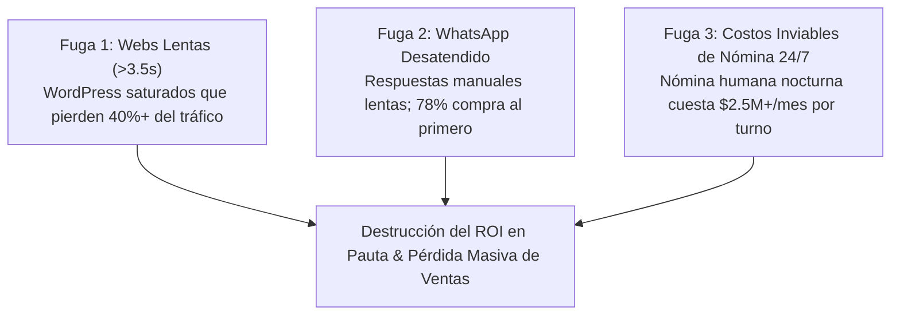
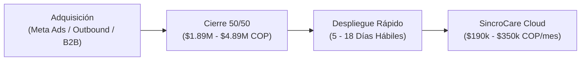
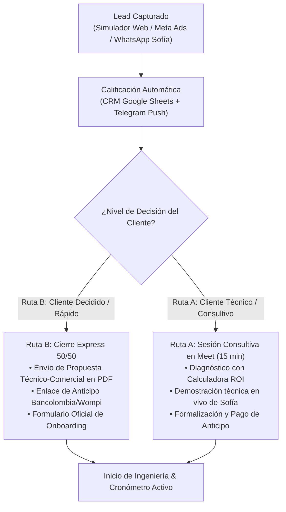
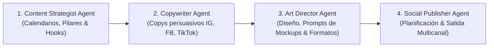
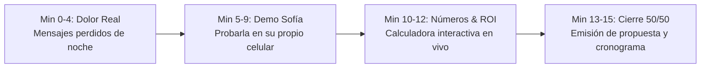
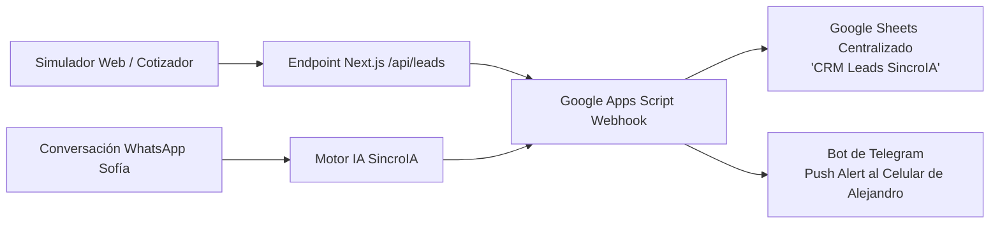
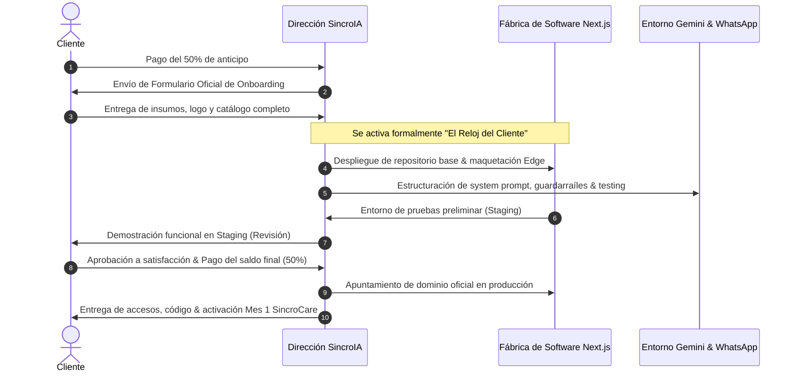
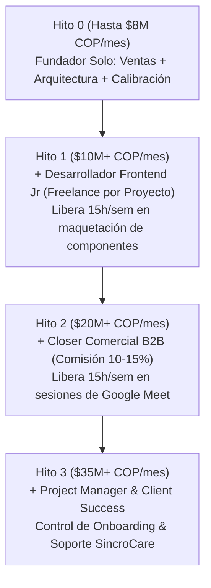
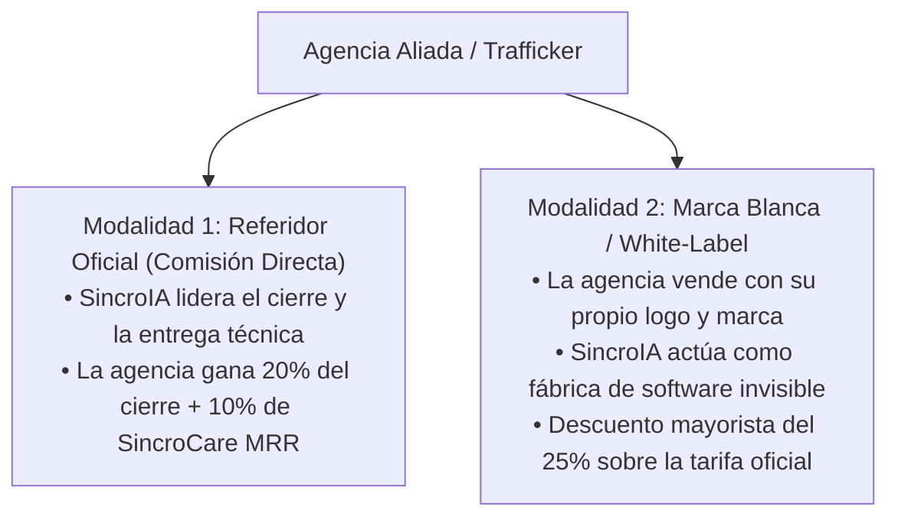
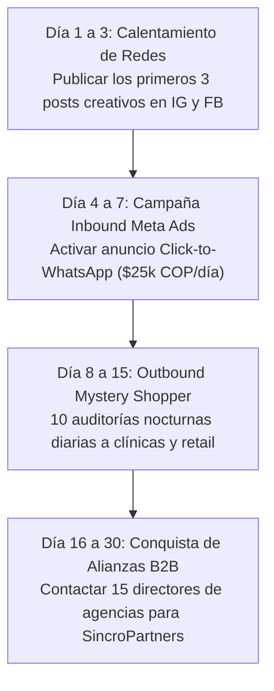

# 🚀 PLAN DE NEGOCIOS Y PLAYBOOK ESTRATÉGICO MAESTRO
## SincroIA — Software de Alto Rendimiento & Automatización con IA

**Versión:** 2.0 (Oficial — Actualizada con Suite de Mercadeo & Embudo Dual)  
**Fecha de Actualización:** Septiembre 2026  
**Sede Principal:** Bogotá D.C., Colombia  
**Cobertura:** Colombia y Latinoamérica  
**Representante Legal & Director de Ingeniería:** Ing. Alejandro Melo Gutiérrez  
**Dominio Oficial:** [https://www.sincroia.lat](https://www.sincroia.lat)  
**Centro de Operaciones de Marketing:** [https://www.sincroia.lat/marketing-hub](https://www.sincroia.lat/marketing-hub)  
**Contacto Directo & WhatsApp Business:** [+57 312 463 0488](https://wa.me/573124630488)  
**Correo Institucional:** `contacto@sincroia.lat`  
**Instagram Oficial:** [@sincroia.lat](https://www.instagram.com/sincroia.lat/)  
**Facebook Oficial:** [SincroIA — Software de Alto Rendimiento](https://www.facebook.com/profile.php?id=61594315517827#)  

---

## ÍNDICE GENERAL

1. [Resumen Ejecutivo, Tesis de Inversión & Gobernanza](#1-resumen-ejecutivo-tesis-de-inversión--gobernanza)
2. [El Problema de Mercado & Ventana de Oportunidad](#2-el-problema-de-mercado--ventana-de-oportunidad)
3. [Propuesta de Valor & Ventaja Competitiva Injusta](#3-propuesta-de-valor--ventaja-competitiva-injusta)
4. [Arquitectura de Servicios & Modelo de Monetización](#4-arquitectura-de-servicios--modelo-de-monetización)
5. [Estrategia de Ingresos Recurrentes (MRR - SincroCare)](#5-estrategia-de-ingresos-recurrentes-mrr---sincrocare)
6. [Unit Economics & Estructura de Márgenes](#6-unit-economics--estructura-de-márgenes)
7. [Perfil de Cliente Ideal (ICP) & Criterios de Selección](#7-perfil-de-cliente-ideal-icp--criterios-de-selección)
8. [Embudo Comercial Unificado & La Estrategia Dual de Conversión](#8-embudo-comercial-unificado--la-estrategia-dual-de-conversión)
9. [Motor Integral de Marketing, Adquisición & Activos Digitales](#9-motor-integral-de-marketing-adquisición--activos-digitales)
10. [Framework de Cierre Consultivo (15 Minutos) & Manejo de Objeciones](#10-framework-de-cierre-consultivo-15-minutos--manejo-de-objeciones)
11. [Gestión Comercial, CRM Centralizado & Pipeline en WhatsApp](#11-gestión-comercial-crm-centralizado--pipeline-en-whatsapp)
12. [Modelo Operativo, Stack Técnico & "El Reloj del Cliente"](#12-modelo-operativo-stack-técnico--el-reloj-del-cliente)
13. [Proyección Financiera a 12 Meses](#13-proyección-financiera-a-12-meses)
14. [Gestión de Riesgos, Blindaje Jurídico & Normativa Colombiana](#14-gestión-de-riesgos-blindaje-jurídico--normativa-colombiana)
15. [Plan de Escalabilidad, Delegación & Contratación por Hitos](#15-plan-de-escalabilidad-delegación--contratación-por-hitos)
16. [Programa SincroPartners: Alianzas B2B & Marca Blanca para Agencias](#16-programa-sincropartners-alianzas-b2b--marca-blanca-para-agencias)
17. [Hoja de Ruta de Ejecución Inmediata](#17-hoja-de-ruta-de-ejecución-inmediata)

---

## 1. RESUMEN EJECUTIVO, TESIS DE INVERSIÓN & GOBERNANZA

### 1.1 ¿Qué es SincroIA?
**SincroIA** es una firma de ingeniería tecnológica especializada en **software de ultra alto rendimiento y automatización de procesos comerciales mediante agentes autónomos de Inteligencia Artificial**. 

A diferencia de las agencias de marketing digital tradicionales (que enfocan su oferta en impresiones, métricas vanidosas y pauta sin solucionar la operatividad ni la conversión interna) o de las fábricas de software pesadas (cuyos presupuestos superan los $15.000.000 COP y tardan meses en entregar), SincroIA construye **sistemas llave en mano**:
* **Portales Web Nativos en Next.js 15:** Con arquitectura *Edge Serverless* optimizada para cargas inferiores a 0.8s en dispositivos móviles bajo condiciones objetivo.
* **Agentes de IA Conversacional (Gemini Flash):** Conectados a WhatsApp Business oficial, entrenados con el catálogo y políticas del negocio, capaces de atender a 50 clientes simultáneamente, calificar presupuestos, entregar cotizaciones y agendar reuniones 24/7 sin descanso.

### 1.2 Gobernanza & Representación Legal
* **Director de Ingeniería & Representante Legal:** Ing. Alejandro Melo Gutiérrez.
* **Jurisdicción:** República de Colombia, operando bajo cumplimiento formal de la legislación comercial, tributaria (RUT activo) y régimen de protección de datos personales.
* **Filosofía de Trabajo:** *Ingeniería antes que retórica*. Transparencia radical en alcances técnicos, código de alto rendimiento libre de ataduras cautivas y enfoque estricto en el Retorno de Inversión (ROI) del cliente.

### 1.3 Misión y Visión
* **Misión:** Erradicar la fuga silenciosa de ingresos y el abandono de prospectos en medianas empresas de habla hispana, dotándolas de infraestructura digital instantánea y agentes de IA que transforman visitas en ventas efectivas.
* **Visión a 3 Años (2026 - 2029):** Consolidar a SincroIA como la firma referente de automatización con IA y desarrollo web moderno para más de 300 empresas en Colombia y la región andina, cimentando una facturación recurrente (MRR) superior a los **$50.000.000 COP mensuales**.

---

## 2. EL PROBLEMA DE MERCADO & VENTANA DE OPORTUNIDAD

En Colombia y América Latina existen más de 1.8 millones de empresas registradas. Al evaluar sus canales comerciales digitales, más del 90% padece tres problemas crónicos:

1. **Lentitud Crítica en Móviles:** La mayoría de páginas corporativas y tiendas virtuales fueron creadas en WordPress/Elementor con decenas de plugins. Tardan entre 3.5 y 6 segundos en cargar en smartphones. En campañas de Meta Ads y Google Ads, **cada segundo de espera reduce las conversiones en un 20%**.
2. **Abandono en WhatsApp por Respuestas Tardías:** El 78% de los compradores digitales compran al primer comercio que les contesta. Cuando un prospecto escribe a las 8:00 PM o un domingo y debe esperar hasta el lunes a las 9:00 AM, la venta ya se perdió a favor del competidor.
3. **El Dilema Financiero de la Atención 24/7:** Contratar un asesor humano para cubrir noches y fines de semana implica salario mínimo legal + prestaciones sociales + auxilio de transporte + recargos nocturnos y dominicales (**~$2.400.000 a $2.800.000 COP/mes por persona**), cubriendo solo 8 horas y con capacidad de chatear con una sola persona a la vez.

**La Oportunidad SincroIA:** Entregar un sistema integral que cuesta menos que un mes de nómina, no duerme, procesa 50 chats en paralelo y se entrega totalmente terminado en 7 a 15 días hábiles.

---

## 3. PROPUESTA DE VALOR & VENTAJA COMPETITIVA INJUSTA

| Variable Estratégica | Agencias Tradicionales | Bots Baratos (Chatfuel / ManyChat) | **SincroIA.lat** |
|---|---|---|---|
| **Arquitectura Web** | WordPress lento, plugins pesados | No incluyen desarrollo web | **Next.js 15, Tailwind, Vercel Edge (<0.8s)** |
| **Motor de Inteligencia** | No usan IA real | Menús rígidos con botones *(«Marque 1»)* | **LLM Generativo (Gemini Flash) con lenguaje natural** |
| **Tiempo de Respuesta** | Horas o días hábiles | Rápido pero mecánico y frustrante | **Menos de 2.0s con empatía ejecutiva contextual** |
| **Protocolo de Relevo Humano** | Desorden manual en la bandeja | Requiere cambiar de ventana/panel | **Silenciado automático inteligente de 45 min o comando `#bot`** |
| **Propiedad del Software** | Cautivos en plugins y servidores de agencia | Plataforma rentada de terceros | **100% código entregado al cliente, sin retención** |
| **Integración de Pasarelas** | Woocommerce pesado o Shopify con % | Enlaces externos genéricos | **Wompi, Bold, PSE, Nequi (0% comisiones a SincroIA)** |
| **Inversión de Implementación** | $8.000.000 – $18.000.000 COP | $300.000 COP (inútil para ventas) | **$1.890.000 – $4.890.000 COP (Punto óptimo de alto valor)** |

---

## 4. ARQUITECTURA DE SERVICIOS & MODELO DE MONETIZACIÓN

El modelo de ingresos de SincroIA se estructura en un esquema híbrido de alta rentabilidad: **Tarifa de Implementación Inicial (Flujo de Caja Inmediato)** + **Mantenimiento y Servidores Cloud Recurrentes (MRR)**.

### 4.1 Paquetes Principales de Implementación (Pago Único)

#### 1. Plan Web Base — $1.890.000 COP
* **Perfil:** Negocios que necesitan modernizar su presencia digital y maximizar la retención de sus campañas de publicidad.
* **Alcance:**
  * Portal web a medida de hasta 5 secciones en Next.js 15 y Tailwind CSS.
  * Carga instantánea inferior a 0.8s en celulares bajo condiciones objetivo.
  * Dominio `.com` o `.co` por 1 año y certificado SSL HTTPS incluido.
  * Formulario conectado en tiempo real al CRM de Google Sheets y Telegram Push.
  * Botón flotante contextual con enlace directo a WhatsApp.
  * Entrega ágil: **5 a 7 días hábiles** tras recepción de insumos completos.

#### 2. Plan Agente IA Pro — $2.490.000 COP
* **Perfil:** Empresas con flujo diario de mensajes en WhatsApp que buscan calificar prospectos y agendar citas en automático.
* **Alcance:**
  * Agente de IA (Sofía o personalizada) entrenada con catálogo de hasta 50 productos/servicios, tarifas y políticas.
  * Conexión a 1 línea de WhatsApp Business del cliente (infraestructura Baileys 24/7 en Railway o Meta Cloud API).
  * Calificación automática de presupuesto y sincronización con Google Calendar.
  * Protocolo de Relevo Humano (pausa inteligente de 45 minutos si un asesor interviene o mediante comando `#pausar`).
  * Ficha ejecutiva de compra disparada a Telegram o WhatsApp del equipo comercial.
  * Primer mes de servidor cloud 24/7 y 5.000 mensajes incluidos.
  * Entrega ágil: **7 a 10 días hábiles** tras insumos y vinculación.

#### 3. Plan E-commerce Pro — $3.690.000 COP
* **Perfil:** Marcas de retail, moda, calzado o productos físicos que quieren vender en línea sin pagar comisiones mensuales a Shopify.
* **Alcance:**
  * Tienda virtual en código nativo de ultra alta velocidad para hasta 50 productos con variantes.
  * Integración de pasarelas colombianas: Wompi (Bancolombia), Bold, PSE, Nequi y tarjetas.
  * Carrito y checkout fluido sin fricción; botón de compra asistida por WhatsApp.
  * Panel administrativo privado para gestión de pedidos, stock y precios.
  * Entrega ágil: **12 a 15 días hábiles**.

#### 4. Plan Ecosistema Total (Paquete Insignia) — $4.890.000 COP
* **Perfil:** Empresas que buscan una transformación comercial completa de 360 grados.
* **Desglose de Valor Individual:**
  * Web Comercial de Alto Rendimiento: $1.890.000 COP
  * Agente de IA Comercial Pro 24/7: $2.490.000 COP
  * Módulo Transaccional / Cotizador Dinámico Paramétrico: $1.210.000 COP
  * *Valor Contratación Individual:* **$5.590.000 COP**
  * **Inversión Oficial Ecosistema:** **$4.890.000 COP** *(Ahorro exacto y documentado de $700.000 COP)*.
* **Alcance:** Web + Agente WhatsApp + Cotizador interactivo sincronizados sobre una misma base de datos.
* **Entrega ágil:** **14 a 18 días hábiles**.

---

### 4.2 Módulos Adicionales (Upselling de Alto Margen)
Disponibles como complementos directos en el simulador interactivo y cotizaciones:
* **Facturación Electrónica DIAN Automática (Siigo / Factus / Alegra):** +$850.000 COP (+3 a 5 días).
* **Agente IA para Instagram DM y Facebook Messenger:** +$750.000 COP (+2 a 3 días).
* **Pasarelas de Pago Colombia (Wompi / Bold / PSE):** +$590.000 COP.
* **Sistema de Citas y Reservas Sincronizado (Google Calendar):** +$490.000 COP.
* **CRM y Base de Datos Automatizada en Google Sheets:** +$490.000 COP.
* **Gestor de Blog y Contenidos SEO Dinámico:** +$550.000 COP.
* **Sistema Multi-idioma (Español / Inglés):** +$450.000 COP.
* **Sistema de Suscripciones y Cobros Recurrentes:** +$690.000 COP.

---

## 5. ESTRATEGIA DE INGRESOS RECURRENTES (MRR - SINCROCARE)

Para blindar la estabilidad financiera de la agencia frente a la volatilidad de proyectos nuevos, todo cliente es incorporado al ecosistema de continuidad operativa **SincroCare**.

### 5.1 Niveles Oficiales de SincroCare

| Nivel | Inversión Mensual | Bolsa de Mensajes IA | Servidor Cloud & Hosting | Nivel de Servicio (SLA) |
|---|:---:|:---:|:---:|---|
| 🥉 **Starter** *(Estándar Pyme)* | **$190.000 COP/mes** | Hasta **5.000 chats/mes** | Servidor Docker 24/7 + Edge Vercel 99.9% | 1 ajuste mensual de catálogo, reconexión de sesión y monitoreo preventivo. |
| 🥈 **Growth** *(Pauta Activa)* | **$350.000 COP/mes** | Hasta **20.000 chats/mes** | Instancia optimizada para picos de tráfico | 2 ajustes mensuales de catálogo, alertas push prioritarias y soporte en < 4 horas. |
| 🥇 **Enterprise** *(Corporativo)* | **$590.000 COP/mes** | **Chats Ilimitados** | Servidor cloud exclusivo de alta potencia | Soporte VIP en < 1 hora, calibración quincenal de prompts y reporte ejecutivo de conversión. |

### 5.2 Políticas de Transparencia y Consumo Excedente
* **Primer Mes 100% Bonificado:** Toda contratación de implementación incluye los primeros 30 días calendario de SincroCare Starter sin costo.
* **Consumo Extraordinario Transparente:** Si una campaña publicitaria hace que el cliente sobrepase los 5.000 chats de su bolsa Starter, cada mensaje procesado por la IA se factura a tan solo **$25 COP**, o el cliente puede ascender al plan Growth. Cero cortes de servicio abruptos.
* **Libertad de Autogestión (Cero Ataduras):** Si un cliente prefiere administrar sus propios servidores, SincroIA le transfiere repositorios, credenciales y documentación sin trabas ni penalizaciones. SincroCare se mantiene por su indiscutible valor y tranquilidad, no por cautiverio.

---

## 6. UNIT ECONOMICS & ESTRUCTURA DE MÁRGENES

Gracias a la arquitectura *Serverless* (Next.js) y la eficiencia del modelo Gemini Flash, los costos marginales directos son mínimos, permitiendo márgenes brutos superiores al 85%.

### 6.1 Desglose de Costos Directos SincroCare Starter ($190.000 COP/mes)

| Componente Técnico | Costo Mensual USD | Costo en COP (TRM ~$4.000) |
|---|---|---|
| Hosting Edge Web (Vercel distribuido) | $0.50 USD | ~$2.000 COP |
| Servidor VPS/Docker WhatsApp (Railway) | $3.50 USD | ~$14.000 COP |
| Consumo Tokens IA (Gemini Flash ~5.000 chats) | $1.50 USD | ~$6.000 COP |
| Reserva de Contingencia Técnica | $1.00 USD | ~$4.000 COP |
| **COSTO DIRECTO MENSUAL TOTAL** | **$6.50 USD** | **~$26.000 COP** |
| **PRECIO DE VENTA OFICIAL** | **$47.50 USD** | **$190.000 COP** |
| **MARGEN BRUTO POR CLIENTE** | **$41.00 USD** | **$164.000 COP (86.3% de Margen)** |

> [!TIP]
> **El Efecto Bola de Nieve del MRR:** Al alcanzar 30 clientes en SincroCare ($190k promedio), la empresa genera **$5.700.000 COP/mes de ingreso recurrente puro con más de $4.900.000 COP de utilidad neta recurrente**, cubriendo la totalidad de los costos fijos operativos antes de vender un solo proyecto en el mes.

---

## 7. PERFIL DE CLIENTE IDEAL (ICP) & CRITERIOS DE SELECCIÓN

Para garantizar casos de éxito de alto impacto y evitar clientes conflictivos o sin capacidad de pago, SincroIA aplica un filtro estricto:

### 7.1 Los 4 Nichos de Enfoque Primario
1. **Clínicas Médicas, Odontológicas & Centros de Estética:** Alto ticket promedio ($300k a $5M COP), consultas nocturnas constantes de pacientes y necesidad urgente de sincronización con Google Calendar.
2. **Marcas de Retail, Moda Urbana & Calzado:** Gran volumen de tráfico en redes sociales, alta tasa de abandono en carritos lentos y saturación de preguntas rutinarias sobre tallas y envíos.
3. **Servicios B2B, Ingeniería, Logística & Suministros:** Ventas corporativas donde la cotización tradicional tarda 48 horas. Un cotizador interactivo y un agente que responde en 2 segundos asegura el contrato frente a la competencia.
4. **Inmobiliarias & Concesionarios:** Cientos de prospectos curiosos al mes. El agente califica capacidad financiera y ubicación antes de pasar el lead al asesor comercial.

### 7.2 Criterios de Calificación Innegociables
* ✅ Facturación mensual mínima demostrable de $12.000.000 COP.
* ✅ Inversión activa en Meta Ads/Google Ads o flujo orgánico superior a 15 mensajes diarios en WhatsApp.
* ✅ Ticket promedio de venta superior a $80.000 COP.
* ❌ **Descartar de Inmediato:** Emprendimientos en fase de idea sin clientes reales, cazadores de precios bajos que comparan con bots de $100.000 COP o clientes que solicitan reuniones presenciales interminables antes de revisar la propuesta.

---

## 8. EMBUDO COMERCIAL UNIFICADO & LA ESTRATEGIA DUAL DE CONVERSIÓN

Tradicionalmente, las agencias cometen el error de forzar a todo prospecto a una llamada de Google Meet de 45 minutos. SincroIA opera con un **Embudo de Doble Ruta (Dual-Path Funnel)** que se adapta al nivel de sofisticación y urgencia del cliente:

### 8.1 Ruta A: Sesión Consultiva en Google Meet (15 Minutos)
* **Para quién:** Directores generales, comités corporativos o dueños de negocio que requieren ver la tecnología funcionando en vivo y entender la arquitectura.
* **Estructura de la Reunión:**
  * Minutos 0 a 4: Diagnóstico y cálculo de fuga de prospectos.
  * Minutos 5 a 9: Demostración técnica de Sofía en tiempo real.
  * Minutos 10 a 12: Simulación de rentabilidad con la Calculadora de ROI en `sincroia.lat#calculadora-roi`.
  * Minutos 13 a 15: Cierre comercial y emisión de propuesta formal.

### 8.2 Ruta B: Cierre Directo Express 50/50 (Sin Esperas)
* **Para quién:** Compradores decididos, negocios con campañas de pauta activas perdiendo dinero hoy o prospectos que ya utilizaron el simulador web y eligieron su paquete.
* **Mecanismo:**
  1. Sofía o el Director Comercial emite la [Plantilla de Propuesta Comercial Express](docs/PLANTILLA_PROPUESTA_COMERCIAL_EXPRESS.md) personalizada con código oficial `SINCRO-2026-XX`.
  2. El cliente confirma por WhatsApp o correo su aceptación (conforme a la Ley 527 de 1999 de Comercio Electrónico).
  3. Realiza la transferencia del anticipo del 50% a la cuenta oficial de Bancolombia o enlace Wompi.
  4. Recibe inmediatamente el enlace al [Formulario Oficial de Onboarding en Google Forms](docs/GUIA_FORMULARIO_ONBOARDING_GOOGLE_FORMS.md).
  5. Una vez diligenciado, se activa el cómputo oficial de días hábiles ("El Reloj del Cliente").

---

## 9. MOTOR INTEGRAL DE MARKETING, ADQUISICIÓN & ACTIVOS DIGITALES

Para alimentar continuamente el pipeline comercial, SincroIA implementa un ecosistema de mercadeo multicanal apoyado en agentes autónomos internos y activos creativos de alto impacto.

### 9.1 El Centro de Operaciones: Marketing Hub Autónomo (`/marketing-hub`)
Ubicado en `https://www.sincroia.lat/marketing-hub`, este panel de control interno centraliza la inteligencia comercial de la agencia y coordina el trabajo de 4 agentes especializados desarrollados en `lib/marketing-agents/`:

1. **Content Strategist Agent:** Analiza tendencias del mercado de IA, define los 4 pilares editoriales (Dolor Operativo, Demostración de Velocidad, Desglose Financiero de ROI y Autoridad Técnica) y genera los ganchos (*hooks*) de alta retención.
2. **Copywriter Agent:** Redacta textos persuasivos bajo marcos AIDA y PAS, formateados con saltos de línea optimizados para lectura móvil y llamadas a la acción (*CTAs*) directas a WhatsApp.
3. **Visual Art Director Agent:** Estandariza la paleta cromática de la marca (fondo obsidian `#030712`, acentos cian `#06b6d4` e índigo `#6366f1`), generando especificaciones precisas para carruseles, infografías y mockups en Figma o IA generativa.
4. **Social Publisher Agent:** Gestiona la distribución y sincronización de contenidos en los canales oficiales.

---

### 9.2 Canales Oficiales de Distribución Digital
* **Instagram ([@sincroia.lat](https://www.instagram.com/sincroia.lat/)):** Canal principal de atracción visual. Presenta reels de comparativas de velocidad, demostraciones en pantalla de Sofía respondiendo de noche y carruseles educativos de ROI.
* **Facebook ([Página Oficial SincroIA](https://www.facebook.com/profile.php?id=61594315517827#)):** Dirigido al segmento de dueños de pymes tradicionales, gerentes comerciales y directores de empresas B2B. Conecta directamente el botón principal de la página a WhatsApp Business.
* **TikTok & YouTube Shorts:** Clips verticales de 30 a 45 segundos con el formato *"Grabando pantalla a las 11:30 PM: Escribiéndole a 3 empresas vs cómo atiende un Agente de IA"*.
* **WhatsApp Business (+57 312 463 0488):** Centro neurálgico de conversión, con catálogo de los 4 planes oficiales configurado y Sofía respondiendo en menos de 2 segundos.

---

### 9.3 Los 11 Activos Gráficos Creativos Oficiales en Producción (`public/marketing/`)
Desplegados en alta resolución en la infraestructura web y listos para campañas orgánicas y pauta paga:

1. **`post_01_vendedor_24_7.png` — El Vendedor Que Nunca Duerme:** Demuestra la atención ininterrumpida a las 11:45 PM cuando la competencia está fuera de línea.
2. **`post_02_web_lenta.png` — ¿Tu Web Tarda Más de 3 Segundos?:** Visualiza la fuga del 40% del presupuesto de pauta en sitios WordPress lentos.
3. **`post_03_nomina_vs_ia.png` — Nómina Nocturna vs. Agente de IA:** Comparativa matemática limpia: $2.5M COP/mes por un turno humano vs. $2.49M pago único por un Agente 24/7.
4. **`post_04_embudo_whatsapp.png` — De Clic en Redes a Compra en WhatsApp:** Flujo continuo sin fricción ni carritos abandonados.
5. **`post_05_costo_inaccion.png` — El Costo Invisible de Responder Tarde:** Revela el dato de la industria: el 78% de los prospectos compran al primer comercio que contesta.
6. **`post_06_stack_nextjs.png` — Next.js 15 Edge vs. Plugins Obsoletos:** Posicionamiento de ingeniería de software para tomadores de decisiones técnicos.
7. **`post_07_calculadora_roi.png` — Simula tu Retorno de Inversión en Vivo:** Invitación directa a utilizar la herramienta interactiva en `sincroia.lat#calculadora-roi`.
8. **`post_08_caso_clinicas.png` — Caso de Estudio Clínicas & Estética:** Agendamiento de citas en Google Calendar en menos de 90 segundos.
9. **`post_09_sin_comisiones_ecommerce.png` — Adiós a las Comisiones de Shopify:** Tienda online propia con pasarelas colombianas Wompi/Bold y 0% comisión a terceros.
10. **`post_10_seguridad_guardarrailes.png` — Blindaje y Guardarraíles de IA:** Tranquilidad para el cliente: el agente solo responde información del catálogo oficial y cuenta con protocolo de relevo humano.
11. **`post_11_oferta_fundador.png` — Convocatoria Cliente Fundador:** Oferta de tracción acelerada con 30% de descuento a cambio de testimonio documentado.

---

### 9.4 Estrategia Inbound: Meta Ads (Click-to-WhatsApp)
* **Presupuesto Inicial Recomendado:** $25.000 a $35.000 COP / día.
* **Público Objetivo:** Colombia (Bogotá, Medellín, Cali, Barranquilla, Bucaramanga), hombres y mujeres de 26 a 55 años, administradores de páginas de Facebook e Instagram, interesados en Comercio Electrónico, Emprendimiento o Gestión de Ventas.
* **Destino del Anuncio:** WhatsApp Business oficial (`+57 312 463 0488`) con mensaje inicial predeterminado:  
  *«Hola Sofía 👋 Vi el anuncio en Instagram y quiero saber cómo automatizar la atención y ventas de mi empresa con IA.»*
* **Métrica Objetivo:** Costo por conversación iniciada entre **$1.800 y $3.200 COP**. Con $30.000 COP diarios se capturan entre 10 y 16 prospectos calificados por jornada.

---

### 9.5 Estrategia Outbound: Auditoría Quirúrgica "Mystery Shopper" (Cliente Incógnito)
* **Mecánica de Prospección Fría a Costo $0:**
  1. Explorar la Biblioteca de Anuncios de Meta (*Facebook Ad Library*) y seleccionar 10 empresas al día con pauta activa en los nichos clave.
  2. Abrir su enlace publicitario desde un teléfono móvil y cronometrar los segundos de carga en PageSpeed Insights.
  3. Enviar un mensaje a su WhatsApp comercial a las 7:45 PM consultando por un servicio o precio.
  4. A la mañana siguiente, documentar la demora en un mensaje de diagnóstico respetuoso y personalizado:

> **Guion de Contacto Mystery Shopper:**  
> *"Hola [Nombre del Dueño o Empresa], un saludo cordial. Noté que tienen campañas activas en Instagram promocionando sus servicios de [Servicio], pero al consultar por WhatsApp anoche a las 7:45 PM el mensaje quedó sin respuesta hasta hoy.*  
>  
> *En empresas de su sector, más del 50% de las consultas ocurren en horario nocturno y el 78% de los prospectos cierran con el primer proveedor que les contesta de inmediato.*  
>  
> *Les grabé un video de 45 segundos mostrando cómo un Agente de IA califica al prospecto y entrega cotizaciones exactas en menos de 2 segundos 24/7. ¿A qué número o correo les puedo remitir la auditoría sin costo ni compromiso?"*

---

## 10. FRAMEWORK DE CIERRE CONSULTIVO (15 MINUTOS) & MANEJO DE OBJECIONES

Las sesiones virtuales de SincroIA siguen una coreografía precisa de 15 a 20 minutos orientada a la toma de acción inmediata:

### Respuestas a Objeciones Habituales:
* **"Ya tengo una recepcionista / asesora que responde el WhatsApp."**  
  * *Respuesta:* «Totalmente de acuerdo, y tu asesora es fundamental para el cierre humano. El problema es que una persona no puede chatear con 8 personas a la vez ni responde un domingo a las 11:00 PM. Nuestro agente atiende en 2 segundos, filtra a los curiosos y le entrega a tu asesora el cliente listo para transferir o agendado en su calendario. Es un multiplicador para tu equipo, no un sustituto.»
* **"Me ofrecieron un bot de $300.000 COP en otra parte."**  
  * *Respuesta:* «Es comprensible mirar el precio de entrada. Esos sistemas económicos son árboles de decisión de botones rígidos ('marque 1 o 2') que enfurecen al usuario moderno y no entienden lenguaje natural. SincroIA implementa modelos de lenguaje generativo con el catálogo de tu empresa y código propio. Con 2 ventas que rescates un fin de semana, la inversión de $2.49M queda amortizada.»
* **"¿Qué pasa si la IA se equivoca o inventa información falsa?"**  
  * *Respuesta:* «Configuramos guardarraíles técnicos inquebrantables: la IA solo responde datos presentes en tu dossier oficial aprobado. Ante preguntas fuera de catálogo, deriva cortésmente con un especialista humano. Y si tú o tu equipo escriben en el chat, el protocolo de Relevo Humano silencia al bot de inmediato durante 45 minutos.»

---

## 11. GESTIÓN COMERCIAL, CRM CENTRALIZADO & PIPELINE EN WHATSAPP

Para erradicar la pérdida de prospectos y garantizar un seguimiento comercial impecable sin incurrir en licencias costosas como HubSpot o Salesforce en etapas tempranas, SincroIA opera con una arquitectura de trazabilidad dual:

### 11.1 Arquitectura del CRM en Google Sheets & Telegram Push
Tanto el simulador interactivo de la web (`/api/leads`) como el motor de WhatsApp (`lib/agent/engine.ts`) transmiten los prospectos en tiempo real:

* **Ficha Técnica del Lead:** Cada registro incluye fecha y hora, nombre del contacto, empresa, número de teléfono (formateado como texto `'+\d+` para evitar errores de cálculo en hojas de cálculo), plan seleccionado, módulos adicionales, presupuesto estimado y origen (*Web Simulator* o *WhatsApp Agent*).
* **Alerta Inmediata en Telegram:** Dispara una notificación sonora al celular del Director de Ingeniería en menos de 3 segundos con botón de marcado directo hacia el prospecto.

### 11.2 Las 5 Etiquetas Oficiales en WhatsApp Business
Para la gestión visual del pipeline en la aplicación móvil:
1. 🟡 **Nuevo Prospecto (Lead):** Conversación iniciada por la web o pauta. Sofía en atención activa.
2. 🔵 **Calificado / Propuesta Enviada:** Prospecto con presupuesto validado. Se emitió propuesta formal express o simulador.
3. 🟣 **Sesión Consultiva Agendada:** Cita programada en Google Meet para validación de arquitectura.
4. 🟢 **Cliente Ganado (Anticipo 50% Recibido):** Contrato perfeccionado, onboarding completado y proyecto en línea de desarrollo.
5. ⚪ **Seguimiento Futuro:** Prospecto interesado para reactivación a 30 días.

---

## 12. MODELO OPERATIVO, STACK TÉCNICO & "EL RELOJ DEL CLIENTE"

La rentabilidad de una agencia de ingeniería no depende únicamente de vender, sino de **entregar a tiempo sin desviaciones de alcance (*scope creep*)**.

### 12.1 Matriz de Tiempos de Entrega Oficiales

| Plan / Solución | Inversión Oficial | Plazo de Entrega Estándar | Hito Crítico de Activación |
|---|:---:|:---:|---|
| **Web Base Next.js 15** | $1.890.000 COP | **5 a 7 días hábiles** | Recepción de logo en alta resolución, textos y secciones aprobadas. |
| **Agente IA Pro WhatsApp** | $2.490.000 COP | **7 a 10 días hábiles** | Carga del catálogo estructurado con precios y escaneo de QR. |
| **E-commerce Pro** | $3.690.000 COP | **12 a 15 días hábiles** | Catálogo con variantes y aprobación de llaves API de pasarela (Wompi/Bold). |
| **Ecosistema Total** | $4.890.000 COP | **14 a 18 días hábiles** | Entrega consolidada de insumos completos (Web + IA + Transaccional). |

### 12.2 La Regla de Oro: "El Reloj del Cliente"
> **Cláusula Operativa Inamovible:** Los días hábiles estipulados para la entrega del proyecto comienzan a contabilizarse **única y exclusivamente a partir del momento en que el cliente entrega el 100% de los insumos obligatorios** a través del [Formulario Oficial de Onboarding en Google Forms](docs/GUIA_FORMULARIO_ONBOARDING_GOOGLE_FORMS.md).  
> Si el cliente demora 4 días en enviar fotos o validar credenciales, el cronómetro de ingeniería queda automáticamente congelado sin que ello constituya retraso atribuible a SincroIA.

### 12.3 Regla Financiera 50/50
* **50% de Anticipo:** Obligatorio para reservar capacidad en el sprint de ingeniería y comenzar el desarrollo. No reembolsable una vez iniciados los trabajos.
* **50% de Saldo:** Pagadero contra aprobación funcional en el entorno de pruebas (*Staging*). El apuntamiento de los dominios definitivos y la transferencia de repositorios se efectúa con el 100% de los valores cancelados.

---

## 13. PROYECCIÓN FINANCIERA A 12 MESES

Proyección financiera prudente basada en un ritmo de ventas de **3 a 7 proyectos mensuales** y una tasa de retención en SincroCare del 80%:

### 13.1 Tabla de Proyección Consolidada (Valores en Pesos Colombianos - COP)

| Mes | Nuevos Proyectos | Facturación Implementaciones | Clientes Activos SincroCare | Facturación Recurrente (MRR) | **Facturación Total Mes** | Utilidad Bruta Estimada (~85%) |
|:---:|:---:|:---:|:---:|:---:|:---:|:---:|
| **Mes 1** | 2 ($2.49M + $1.89M) | $4.380.000 | 0 *(Mes 1 bonificado)* | $0 | **$4.380.000** | $3.723.000 |
| **Mes 2** | 3 proyectos | $8.670.000 | 2 | $380.000 | **$9.050.000** | $7.692.500 |
| **Mes 3** | 4 proyectos | $11.560.000 | 5 | $950.000 | **$12.510.000** | $10.633.500 |
| **Mes 4** | 4 proyectos | $12.300.000 | 8 | $1.520.000 | **$13.820.000** | $11.747.000 |
| **Mes 5** | 5 proyectos | $15.400.000 | 11 | $2.090.000 | **$17.490.000** | $14.866.500 |
| **Mes 6** | 5 proyectos | $16.200.000 | 15 | $2.850.000 | **$19.050.000** | $16.192.500 |
| **Mes 7** | 6 proyectos | $18.900.000 | 19 | $3.610.000 | **$22.510.000** | $19.133.500 |
| **Mes 8** | 6 proyectos | $19.500.000 | 23 | $4.370.000 | **$23.870.000** | $20.289.500 |
| **Mes 9** | 6 proyectos | $20.100.000 | 27 | $5.130.000 | **$25.230.000** | $21.445.500 |
| **Mes 10** | 7 proyectos | $23.400.000 | 31 | $5.890.000 | **$29.290.000** | $24.896.500 |
| **Mes 11** | 7 proyectos | $24.000.000 | 35 | $6.650.000 | **$30.650.000** | $26.052.500 |
| **Mes 12** | 8 proyectos | $27.500.000 | 40 | $7.600.000 | **$35.100.000** | $29.835.000 |
| **TOTAL AÑO 1** | **63 proyectos** | **$201.910.000 COP** | **40 retenciones** | **$41.040.000 COP** | **$242.950.000 COP** | **~$206.500.000 COP** |

---

## 14. GESTIÓN DE RIESGOS, BLINDAJE JURÍDICO & NORMATIVA COLOMBIANA

SincroIA opera con estricto apego al marco legal de la República de Colombia para salvaguardar la responsabilidad de la agencia y la de sus clientes:

### 14.1 Validez de Contratación Electrónica (Ley 527 de 1999)
* **Comercio Electrónico & Mensajes de Datos:** Conforme a la Ley 527 de 1999, los acuerdos comerciales formalizados mediante intercambio de mensajes de datos (correo electrónico institucional o confirmación vía WhatsApp oficial), acompañados del comprobante de transferencia bancaria del anticipo, gozan de plena validez jurídica, fuerza probatoria y perfeccionan el contrato de prestación de servicios de software.
* **Propuesta Formal Vinculante:** Toda contratación se respalda en la [Plantilla de Propuesta Comercial Express](docs/PLANTILLA_PROPUESTA_COMERCIAL_EXPRESS.md) y en el [Contrato Marco de Servicios](docs/CONTRATO_MARCO_SERVICIOS_SINCROIA.md).

### 14.2 Régimen de Protección de Datos Personales (Ley 1581 de 2012 - Habeas Data)
Se delimitan taxativamente las responsabilidades legales sobre las bases de datos de prospectos y clientes:
* **El Cliente Contratante como "Responsable del Tratamiento" (Controller):** Es el titular jurídico de la relación comercial con los usuarios finales que escriben a su WhatsApp o compran en su web. Es responsable de contar con sus políticas de privacidad visibles y autorizaciones correspondientes.
* **SincroIA como "Encargado del Tratamiento" (Processor):** Proporciona la infraestructura técnica, el servidor cloud y la integración con modelos de IA. SincroIA **no comercializa, no cede ni explota las bases de datos** de los clientes de sus contratantes, limitándose a su procesamiento técnico bajo estrictos protocolos de confidencialidad.

### 14.3 Blindaje Antispam en WhatsApp (Meta Compliance)
* Sofía y los agentes desarrollados por SincroIA operan exclusivamente bajo la modalidad **Inbound**: atienden a usuarios que inician la interacción por voluntad propia o que hacen clic en un anuncio publicitario.
* SincroIA prohíbe el uso de sus agentes para envíos masivos de spam en frío (*outbound spam* masivo), protegiendo la reputación del número del cliente contra bloqueos de Meta.

---

## 15. PLAN DE ESCALABILIDAD, DELEGACIÓN & CONTRATACIÓN POR HITOS

Para evitar que el Director de Ingeniería quede atrapado en tareas operativas rutinarias al superar los $10M COP mensuales de facturación, se implementa un modelo de delegación por hitos financieros sostenidos (60 días continuos):

### Matriz de Compensación y Responsabilidades

| Hito Facturación | Rol a Contratar | Modelo de Remuneración | Responsabilidad Principal |
|---|---|---|---|
| **Hito 1 ($10M/mes)** | Dev Frontend Jr / Integrador | Por entregable ($700.000 a $1.000.000 COP/web) | Maquetación visual en Tailwind, pruebas móviles y carga de catálogos CSV. |
| **Hito 2 ($20M/mes)** | Closer B2B de Ventas | Sueldo base de apoyo + Comisión (10% a 15% por cierre) | Conducción de sesiones consultivas en Google Meet y seguimiento de cotizaciones. |
| **Hito 3 ($35M/mes)** | Project Manager / Soporte | Salario fijo ($1.8M a $2.4M COP/mes) + Bono retención | Recepción de onboarding, control del "Reloj del Cliente" y tickets SincroCare. |

---

## 16. PROGRAMA SINCROPARTNERS: ALIANZAS B2B & MARCA BLANCA PARA AGENCIAS

Existen más de 4.500 agencias de publicidad, traffickers y community managers en Colombia y la región que saben correr pauta publicitaria en Meta Ads, pero **no saben programar en Next.js ni construir agentes de IA para WhatsApp**.

Cuando sus clientes se quejan de que *"la pauta no vende porque en WhatsApp responden a las 4 horas"*, la agencia pierde la cuenta. **SincroPartners** soluciona esta brecha mediante dos modalidades:

* **Modalidad 1 (Referidor):** La agencia aliada presenta a SincroIA como su socio de ingeniería. SincroIA cierra la venta y le liquida de inmediato a la agencia el **20% del valor de implementación ($378.000 a $978.000 COP)** más el **10% mensual recurrente de SincroCare** mientras el cliente continúe activo.
* **Modalidad 2 (Marca Blanca):** La agencia revende el paquete a su cliente corporativo por $3.500.000 COP o más. SincroIA cobra a la agencia su tarifa con 25% de descuento mayorista ($1.867.500 COP para IA Pro), entregando la solución bajo el nombre y branding de la agencia aliada.

---

## 17. HOJA DE RUTA DE EJECUCIÓN INMEDIATA

Con la plataforma web, el webhook de WhatsApp en Railway, el CRM automatizado y el Marketing Hub 100% operativos, el plan de acción de los próximos 30 días se enfoca en la generación activa de flujo de caja:

1. **Fase 1 (Días 1 a 3 — Autoridad Visual en Redes):**
   * Publicar los primeros 3 activos de la suite (`post_01_vendedor_24_7.png`, `post_02_web_lenta.png`, `post_03_nomina_vs_ia.png`) en Instagram `@sincroia.lat` y Facebook.
   * Fijar en historias destacadas los pilares: *¿Qué es SincroIA?*, *Demo Sofía*, *Precios Claros* y *Garantía Técnica*.
2. **Fase 2 (Días 4 a 7 — Activación del Motor Inbound):**
   * Configurar campaña de Meta Ads dirigida a WhatsApp Business oficial (+57 312 463 0488) con presupuesto de $25.000 COP diarios.
   * Monitorear el embudo dual: Sofía atendiendo en 1.8s, leads ingresando al CRM de Google Sheets y alertas en Telegram.
3. **Fase 3 (Días 8 a 15 — Prospección Outbound Quirúrgica):**
   * Ejecutar la rutina matutina de 10 auditorías nocturnas Mystery Shopper a negocios en Meta Ad Library.
   * Meta comercial: cerrar los primeros 2 proyectos de implementación ($3.78M a $4.98M COP).
4. **Fase 4 (Días 16 a 30 — Activación de SincroPartners B2B):**
   * Enviar el guion de prospección B2B a 15 directores de agencias de marketing digital en Colombia.
   * Consolidar las 2 primeras agencias aliadas en modalidad de marca blanca.

---

### CONTROL DE VERSIONES Y DOCUMENTOS ASOCIADOS

| Documento Referenciado | Ubicación en Repositorio | Propósito Operativo |
|---|---|---|
| **Propuesta Comercial Express** | [`docs/PLANTILLA_PROPUESTA_COMERCIAL_EXPRESS.md`](./PLANTILLA_PROPUESTA_COMERCIAL_EXPRESS.md) | Formato oficial para cotizaciones y cierres express 50/50. |
| **Guía de Formulario de Onboarding** | [`docs/GUIA_FORMULARIO_ONBOARDING_GOOGLE_FORMS.md`](./GUIA_FORMULARIO_ONBOARDING_GOOGLE_FORMS.md) | Enlace y estructura del formulario de recepción de insumos. |
| **Kit Maestro de Lanzamiento de Redes** | [`docs/KIT_LANZAMIENTO_REDES_SINCROIA.md`](./KIT_LANZAMIENTO_REDES_SINCROIA.md) | Biografías, copys fundacionales y calendario de publicación. |
| **Contrato Marco de Servicios** | [`docs/CONTRATO_MARCO_SERVICIOS_SINCROIA.md`](./CONTRATO_MARCO_SERVICIOS_SINCROIA.md) | Marco contractual exhaustivo bajo legislación colombiana. |
| **Guía CRM Google Sheets** | [`docs/GUIA_CONEXION_GOOGLE_SHEETS_CRM.md`](./GUIA_CONEXION_GOOGLE_SHEETS_CRM.md) | Código Google Apps Script y conexión de base de datos de leads. |
| **Guía Despliegue Railway 24/7** | [`docs/GUIA_DESPLIEGUE_RAILWAY_24_7.md`](./GUIA_DESPLIEGUE_RAILWAY_24_7.md) | Manual de persistencia del daemon WhatsApp Baileys en Docker. |
| **Protocolo Flujo del Cliente** | [`docs/PROTOCOLO_FLUJO_CLIENTE_SINCROIA.md`](./PROTOCOLO_FLUJO_CLIENTE_SINCROIA.md) | SOP paso a paso desde el primer contacto hasta el pase a producción. |
| **Manual de Operaciones & Finanzas** | [`docs/MANUAL_DE_OPERACIONES_Y_PROTOCOLOS_SINCROIA.md`](./MANUAL_DE_OPERACIONES_Y_PROTOCOLOS_SINCROIA.md) | Freno a scope creep, acuerdos SLA y regla financiera 50/30/20. |

---

*Documento estratégico y operacional de carácter confidencial de SincroIA. Diseñado y supervisado por el Ing. Alejandro Melo Gutiérrez.*
