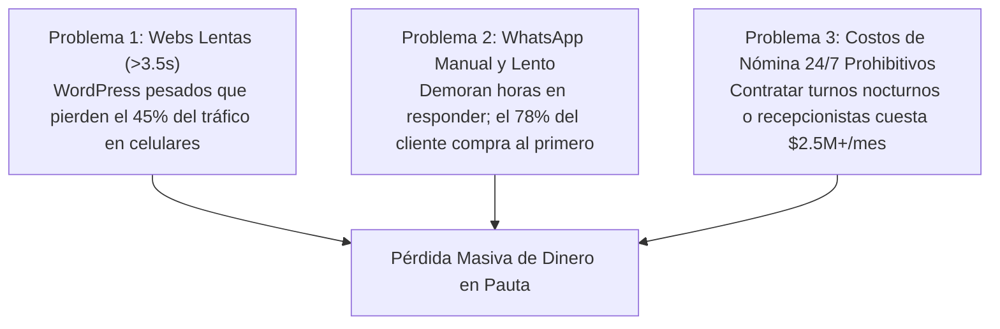
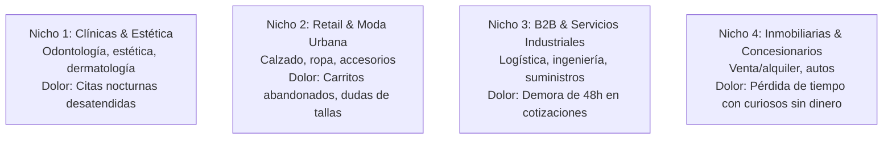
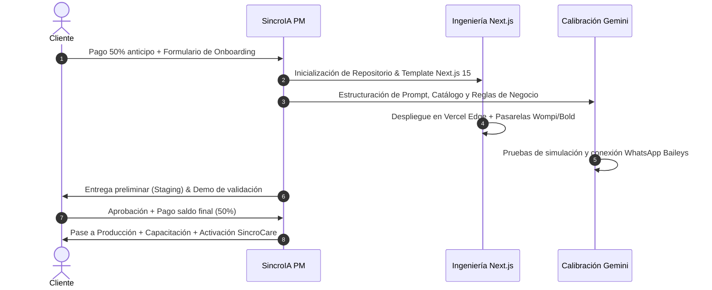

# 🚀 PLAN DE NEGOCIOS Y PLAYBOOK ESTRATÉGICO
## SincroIA — Software de Alto Rendimiento & Automatización con IA

**Versión:** 1.0 (Oficial)  
**Fecha de Actualización:** Septiembre 2026  
**Sede Principal:** Bogotá, Colombia  
**Cobertura:** Colombia y Latinoamérica  
**Dominio Oficial:** [https://www.sincroia.lat](https://www.sincroia.lat)  
**Contacto Oficial:** +57 312 463 0488  

---

## ÍNDICE GENERAL

1. [Resumen Ejecutivo & Tesis de Inversión](#1-resumen-ejecutivo--tesis-de-inversión)
2. [El Problema de Mercado & Oportunidad](#2-el-problema-de-mercado--oportunidad)
3. [Propuesta de Valor & Ventaja Competitiva Injusta](#3-propuesta-de-valor--ventaja-competitiva-injusta)
4. [Arquitectura de Servicios & Modelo de Monetización](#4-arquitectura-de-servicios--modelo-de-monetización)
5. [Estrategia de Ingresos Recurrentes (MRR - SincroCare)](#5-estrategia-de-ingresos-recurrentes-mrr---sincrocare)
6. [Unit Economics & Estructura de Márgenes](#6-unit-economics--estructura-de-márgenes)
7. [Perfil de Cliente Ideal (ICP) & Nichos Clave](#7-perfil-de-cliente-ideal-icp--nichos-clave)
8. [Estrategia Go-To-Market (GTM) & Adquisición de Clientes](#8-estrategia-go-to-market-gtm--adquisición-de-clientes)
9. [Guión Comercial & Manejo de Objeciones](#9-guión-comercial--manejo-de-objeciones)
10. [Modelo Operativo, Stack Técnico & Entrega Ágil](#10-modelo-operativo-stack-técnico--entrega-ágil)
11. [Proyección Financiera a 12 Meses](#11-proyección-financiera-a-12-meses)
12. [Gestión de Riesgos & Blindaje Jurídico](#12-gestión-de-riesgos--blindaje-jurídico)

---

## 1. RESUMEN EJECUTIVO & TESIS DE INVERSIÓN

### 1.1 ¿Qué es SincroIA?
**SincroIA** es una agencia tecnológica especializada en **ingeniería de software de alto impacto y automatización con agentes autónomos de Inteligencia Artificial**. 

A diferencia de agencias de marketing digital tradicionales (que venden publicidad sin solucionar la operatividad de los negocios) o software houses pesadas (con tarifas fuera del alcance de las pymes), SincroIA construye **ecosistemas digitales llave en mano**: portales web nativos en Next.js 15 que abren en menos de 0.8 segundos y asistentes de IA conversacional (Gemini) en WhatsApp que califican prospectos, entregan presupuestos y agendan citas 24/7 sin descanso.

### 1.2 Misión y Visión
* **Misión:** Eliminar la fricción operativa y el abandono de prospectos en empresas de habla hispana mediante software ultra veloz y agentes de IA autónomos que convierten visitas en dinero real.
* **Visión a 3 Años:** Convertirnos en la firma de referencia en automatización con IA y desarrollo web moderno para más de 300 medianas empresas en Colombia, México y la región andina, consolidando una base de ingresos recurrentes (MRR) superior a los $50.000.000 COP mensuales.

---

## 2. EL PROBLEMA DE MERCADO & OPORTUNIDAD

En Colombia y América Latina existen más de 1.8 millones de empresas formales. El 90% enfrenta tres problemas críticos y costosos:

1. **Lentitud Web en Móviles:** La mayoría de empresas tienen páginas construidas en WordPress/Elementor con plugins saturados que tardan más de 3 segundos en abrir en celulares. En campañas de Instagram y Facebook Ads, cada segundo extra de carga reduce las ventas en un 20%.
2. **Pérdida de Prospectos en WhatsApp por Espera:** El 78% de los compradores en internet cierran con el primer negocio que les responde. Cuando una consulta llega después de las 6:00 PM o un domingo, el cliente busca a la competencia.
3. **El Costo Imposible de la Nómina 24/7:** Contratar una recepcionista o asesor de ventas en Colombia cuesta como mínimo un salario mínimo legal + prestaciones + recargos nocturnos y dominicales (**~$2.200.000 a $2.800.000 COP/mes por persona**), y solo cubre un turno de 8 horas. Un Agente de IA de SincroIA atiende a 50 clientes en paralelo, no descansa nunca y cuesta una fracción mensual.

---

## 3. PROPUESTA DE VALOR & VENTAJA COMPETITIVA INJUSTA

| Variable | Agencias Tradicionales | Creadores de Bots Baratos (Chatfuel/ManyChat) | **SincroIA.lat** |
|---|---|---|---|
| **Tecnología Web** | WordPress lento, plantillas pesadas | No ofrecen web | **Next.js 15, Vercel Edge (< 0.8s)** |
| **Cerebro del Bot** | No implementan IA real | Menús rígidos con botones *(«Presione 1»)* | **LLM Generativo (Gemini Flash)** con lenguaje natural y catálogo |
| **Atención en WhatsApp** | Manual por humanos | Rígida y propensa a fallar | **Respuestas en < 2s con Relevo Humano automático** |
| **Cobros & Pasarelas** | Woocommerce lento o Shopify con comisiones | Enlaces externos genéricos | **Integración nativa Wompi, Bold, PSE, Nequi (0% comisiones de plataforma)** |
| **Propiedad del Código** | Cautivos en plugins de terceros | Plataforma rentada | **100% propiedad del cliente sin ataduras** |
| **Precio de Entrada** | $8.000.000 - $15.000.000 COP | $300.000 COP (inútil para ventas complejas) | **$1.890.000 - $4.890.000 COP (Equilibrio perfecto de alto valor)** |

---

## 4. ARQUITECTURA DE SERVICIOS & MODELO DE MONETIZACIÓN

SincroIA opera con un modelo dual: **Tarifa de Implementación Inicial (Cash Flow inmediato)** + **Mantenimiento Recurrente Mensual (MRR para estabilidad financiera)**.

### 4.1 Paquetes Principales (Pago Único de Entrada)

#### 1. Plan Web Base — $1.890.000 COP
* **Dirigido a:** Empresas que necesitan presencia digital rápida, profesional y con máxima velocidad para pauta.
* **Incluye:**
  * Portal web a medida en Next.js 15 y Tailwind CSS.
  * Arquitectura optimizada para carga < 0.8s en celulares (Edge Computing).
  * Dominio profesional .com o .co por 1 año incluido.
  * Configuración técnica SEO inicial para indexación en Google.
  * Entrega en 1 a 2 semanas.

#### 2. Plan Agente IA Pro — $2.490.000 COP
* **Dirigido a:** Negocios que ya tienen tráfico o mensajes diarios pero pierden ventas por demoras en la respuesta manual.
* **Incluye:**
  * Agente de IA entrenado con el catálogo, preguntas frecuentes y políticas de la empresa.
  * Conexión a WhatsApp Business (Multi-Device) y widget web.
  * Calificación automática de prospectos y agendamiento en Google Calendar.
  * Protocolo de Relevo Humano (si el asesor escribe, la IA se silencia 2 horas automáticamente).
  * Alertas push de compra al celular del dueño.

#### 3. Plan E-commerce Pro — $3.690.000 COP
* **Dirigido a:** Marcas de moda, calzado, tecnología o retail que quieren vender online sin pagar comisiones mensuales a Shopify o pasarelas extranjeras.
* **Incluye:**
  * Tienda online transaccional de ultra alta velocidad.
  * Pasarelas Colombia: Wompi (Bancolombia), Bold, PSE, Nequi y Tarjetas.
  * Botón de compra asistida directo a WhatsApp con resumen de pedido.
  * Cero comisiones de plataforma por venta realizada.

#### 4. Plan Ecosistema Total (Paquete Insignia) — $4.890.000 COP
* **Dirigido a:** Empresas que buscan transformar completamente su canal comercial digital.
* **Incluye:**
  * Portal Web Ultra Veloz + Agente de IA para WhatsApp + Pasarela de pagos o cotizador dinámico.
  * Sincronización completa: cada visitante web puede continuar la compra en WhatsApp.
  * Soporte prioritario y capacitación privada de entrega.
  * *(Ahorro comercial de $700.000 COP frente a contratar los servicios por separado).*

---

### 4.2 Módulos Adicionales (Upselling de Alto Margen)
Los módulos se venden como complementos en el formulario de cotización:
* **Facturación Electrónica DIAN Automática (Siigo/Alegra/Factus):** +$850.000 COP
* **Agente IA para Instagram DM y Facebook Messenger:** +$750.000 COP
* **Pasarelas de Pago Colombia (Wompi/Bold/PSE):** +$590.000 COP
* **Sistema de Citas y Reservas Sincronizado:** +$490.000 COP
* **CRM y Base de Datos Automatizada en Google Sheets:** +$490.000 COP
* **Gestor de Blog y Contenidos SEO:** +$550.000 COP
* **Sistema Multi-idioma (Español / Inglés):** +$450.000 COP
* **Sistema de Suscripciones y Cobros Recurrentes:** +$690.000 COP

---

## 5. ESTRATEGIA DE INGRESOS RECURRENTES (MRR - SINCROCARE)

Para evitar la trampa de las agencias de depender exclusivamente de vender proyectos nuevos cada mes, todo cliente pasa a formar parte de **SincroCare**.

### ¿Qué es SincroCare?
* **Precio:** **$190.000 COP / mes** (a partir del mes 2).
* **Garantía Comercial:** El **primer mes es 100% GRATIS** con la compra de cualquier paquete con IA o web.
* **Qué cubre:**
  1. **Servidor Cloud 24/7 Dedicado:** La instancia del bot de WhatsApp y el hosting edge de la web corren en servidores de alta disponibilidad sin depender de la computadora del cliente.
  2. **Bolsa de Tokens de IA:** Cubre miles de consultas y respuestas mensuales procesadas con el modelo Gemini Flash.
  3. **Mantenimiento y Reconexión:** Monitoreo activo de la sesión de WhatsApp, actualización de parches y copias de seguridad de datos.
  4. **Ajuste y Calibración Mensual de Prompts:** Si el cliente cambia precios, horarios o añade un producto al catálogo, se calibra sin costo extra.

---

## 6. UNIT ECONOMICS & ESTRUCTURA DE MÁRGENES

La ventaja de la arquitectura moderna (Next.js serverless + Gemini API) es que los costos variables por cliente son extremadamente bajos:

### 6.1 Costos Directos por Cliente de SincroCare ($190.000 COP/mes)

| Rubro de Costo | Costo Estimado en USD | Costo en COP (TRM 4.000) |
|---|---|---|
| Hosting Edge Web (Vercel Hobby/Pro distribuido) | $0.50 USD | ~$2.000 COP |
| Servidor VPS/Docker WhatsApp (Railway/Render) | $3.50 USD | ~$14.000 COP |
| Consumo Tokens IA (Gemini 3.6 Flash ~5.000 chats) | $1.50 USD | ~$6.000 COP |
| Margen de seguridad operativa | $1.00 USD | ~$4.000 COP |
| **COSTO TOTAL DIRECTO MENSUAL** | **$6.50 USD** | **~$26.000 COP** |
| **PRECIO DE VENTA SINCROCARE** | **$47.50 USD** | **$190.000 COP** |
| **MARGEN BRUTO MENSUAL POR CLIENTE** | **$41.00 USD** | **$164.000 COP (86.3% de Margen)** |

> [!TIP]
> **Poder del MRR:** Con 25 clientes activos en SincroCare, la agencia genera **$4.750.000 COP/mes** de facturación recurrente con más de **$4.100.000 COP de utilidad bruta**, cubriendo costos fijos operativos antes de vender un solo proyecto nuevo.

---

## 7. PERFIL DE CLIENTE IDEAL (ICP) & NICHOS CLAVE

No le vendemos a todo el mundo. Nos enfocamos en 4 nichos que ya tienen demanda y flujo de caja diario:

### Criterios de Calificación de Prospectos (Filtro Anti-Clientes Tóxicos):
* ✅ Facturación mensual demostrable superior a $15.000.000 COP.
* ✅ Invierten activamente en publicidad digital (Meta Ads o Google Ads) o tienen un flujo de al menos 15-20 mensajes diarios en WhatsApp.
* ✅ Venden productos o servicios con ticket promedio superior a $100.000 COP.
* ❌ **Descartar:** Emprendedores sin presupuesto que buscan "un logo barato" o que pretenden regatear precios por debajo de $1.89M.

---

## 8. ESTRATEGIA GO-TO-MARKET (GTM) & ADQUISICIÓN DE CLIENTES

Para crecer con solidez, utilizaremos 3 canales de adquisición complementarios:

### Canal 1: Inbound con "Efecto Demostración" (Meta Ads a WhatsApp)
* **El anuncio:** Videos cortos mostrando la pantalla de un celular: *"Mira cómo este negocio responde y agenda citas en 1.8 segundos mientras el dueño duerme"*.
* **El gancho:** *"Haz clic y habla en vivo con Sofía, nuestro agente de IA, para que veas cómo atiende a tus propios clientes"*.
* **El cierre:** Al entrar a WhatsApp, **Sofía misma vende el servicio**. El cliente experimenta el producto antes de comprarlo. Esto genera una tasa de conversión superior al 35%.

### Canal 2: Outbound de Precisión ("La Auditoría de 60 Segundos")
* **Prospección en frío:** Identificar 10 empresas al día en Instagram que pauten activamente pero que:
  * Su enlace web cargue lento en Google PageSpeed.
  * O su WhatsApp tarde más de 15 minutos en responder.
* **El mensaje no invasivo:**
  > *"Hola [Nombre/Marca], noté que están pautando en Instagram pero su web tarda 4.2 segundos en abrir en celulares, lo que según Google hace perder hasta el 40% de los clics pagados. Les grabé un video de 45 segundos mostrándoles cómo corregir este cuello de botella y cómo un agente de IA puede atender a sus clientes de noche en 2 segundos. ¿Les interesa que se los envíe sin compromiso?"*
* **Tasa esperada:** De 50 contactos, 15 responden, 5 agendan diagnóstico y 1 a 2 cierran.

### Canal 3: Alianzas Estratégicas B2B (Efecto Multiplicador)
* Aliarse con:
  * **Contadores públicos y firmas de nómina:** Ellos conocen empresas que necesitan facturación electrónica DIAN o que quieren recortar costos operativos.
  * **Agencias de Marketing Digital / Media Buyers:** Agencias de pauta que sufren porque sus clientes no convierten las visitas en WhatsApp. SincroIA actúa como su socio tecnológico en marca blanca o con comisión del 10% por referido.

---

## 9. GUIÓN COMERCIAL & MANEJO DE OBJECIONES

### Objeción 1: *"Es que ya tenemos una persona atendiendo el WhatsApp."*
* **Respuesta:**
  > *"Excelente, y esa persona es clave para ventas complejas. El problema es que una persona solo puede responder un chat a la vez, se cansa, y a las 7:00 PM o fines de semana deja de atender. Nuestro Agente de IA no reemplaza a tu asesor: se encarga de los primeros 2 minutos, filtra curiosos, responde preguntas repetitivas y cuando el cliente está con la billetera lista para comprar, le pasa el cliente calificado a tu asesor. Es un multiplicador para tu equipo, no una amenaza."*

### Objeción 2: *"Me parece costoso comparado con otras opciones de $500.000."*
* **Respuesta:**
  > *"Es comprensible fijarse en el precio. Esas opciones baratas suelen ser bots antiguos de botones ('Presione 1 para horario, 2 para ubicación') que frustran a los clientes y no entienden preguntas naturales, o webs de WordPress que demoran 4 segundos en abrir. Con una sola venta que recuperes de noche al mes o evitando 3 carritos abandonados, la inversión de SincroIA se paga sola en los primeros 30 a 60 días."*

### Objeción 3: *"¿Y si el bot se equivoca o inventa información (alucina)?"*
* **Respuesta:**
  > *"Ese es el mayor miedo con la IA amateur. En SincroIA programamos guardarraíles técnicos estrictos: el agente tiene prohibido inventar precios o promesas que no estén en tu base de conocimientos autorizada. Si no sabe un dato, dice con total transparencia: 'Ese detalle específico prefiero consultarlo con un especialista del equipo; ya mismo te comunico con ellos'. Además, cuentas con el protocolo de relevo humano: en cuanto tú escribes una sola palabra en el chat, el bot se silencia automáticamente."*

---

## 10. MODELO OPERATIVO, STACK TÉCNICO & ENTREGA ÁGIL

Para mantener márgenes altos, la entrega de cada proyecto debe estar estandarizada como una línea de ensamblaje en **4 fases (1 a 2 semanas)**:

### Regla Operativa de Oro:
* **Anticipo 50% / Saldo 50% contra entrega:** Nunca se inicia código sin el 50% de anticipo. Las llaves finales del dominio y accesos se entregan con el 100% cancelado.

---

## 11. PROYECCIÓN FINANCIERA A 12 MESES

Proyección financiera realista basada en una meta de adquisición conservadora de **3 a 6 proyectos mensuales** y retención en SincroCare del 80%:

### Métricas de Proyección (En Pesos Colombianos - COP)

| Mes | Nuevos Proyectos | Facturación Proyectos | Clientes SincroCare Activos | Facturación Recurrente (MRR) | **Facturación Total Mes** | Utilidad Bruta Estimada (~85%) |
|:---:|:---:|:---:|:---:|:---:|:---:|:---:|
| **Mes 1** | 2 proyectos ($2.49M + $1.89M) | $4.380.000 | 0 (Mes gratis) | $0 | **$4.380.000** | $3.723.000 |
| **Mes 2** | 3 proyectos | $8.670.000 | 2 | $380.000 | **$9.050.000** | $7.692.500 |
| **Mes 3** | 4 proyectos | $11.560.000 | 5 | $950.000 | **$12.510.000** | $10.633.500 |
| **Mes 4** | 4 proyectos | $12.300.000 | 8 | $1.520.000 | **$13.820.000** | $11.747.000 |
| **Mes 5** | 5 proyectos | $15.400.000 | 11 | $2.090.000 | **$17.490.000** | $14.866.500 |
| **Mes 6** | 5 proyectos | $16.200.000 | 15 | $2.850.000 | **$19.050.000** | $16.192.500 |
| **Mes 7** | 6 proyectos | $18.900.000 | 19 | $3.610.000 | **$22.510.000** | $19.133.500 |
| **Mes 8** | 6 proyectos | $19.500.000 | 23 | $4.370.000 | **$23.870.000** | $20.289.500 |
| **Mes 9** | 6 proyectos | $20.100.000 | 27 | $5.130.000 | **$25.230.000** | $21.445.500 |
| **Mes 10** | 7 proyectos | $23.400.000 | 31 | $5.890.000 | **$29.290.000** | $24.896.500 |
| **Mes 11** | 7 proyectos | $24.000.000 | 35 | $6.650.000 | **$30.650.000** | $26.052.500 |
| **Mes 12** | 8 proyectos | $27.500.000 | 40 | $7.600.000 | **$35.100.000** | $29.835.000 |
| **TOTAL AÑO 1** | **63 proyectos** | **$201.910.000 COP** | **40 retenciones** | **$41.040.000 COP** | **$242.950.000 COP** | **~$206.500.000 COP** |

---

## 12. GESTIÓN DE RIESGOS & BLINDAJE JURÍDICO

Para garantizar la viabilidad a largo plazo de SincroIA en el marco legal colombiano:

1. **Cumplimiento de Habeas Data (Ley 1581 de 2012):**  
   Todo lead capturado en la web o por WhatsApp cuenta con la casilla de aceptación obligatoria de políticas de privacidad.
2. **Prevención de Bloqueos de WhatsApp Business:**  
   No realizamos envíos masivos de spam no solicitados (*outbound spam*). Sofía responde exclusivamente a **inbound** (usuarios que inician la conversación por iniciativa propia tras ver un anuncio o entrar a la web), operando 100% dentro de las directrices de Meta.
3. **Contratos de Servicios de Software:**  
   Todo cliente firma un acuerdo de alcance técnico detallando qué incluye el proyecto, plazos de entrega y aclarando que las integraciones con APIs externas (Google, Meta, pasarelas) están sujetas a la disponibilidad de sus respectivos proveedores.

---

*Documento confidencial para uso operativo, comercial y de planeación de SincroIA.*
