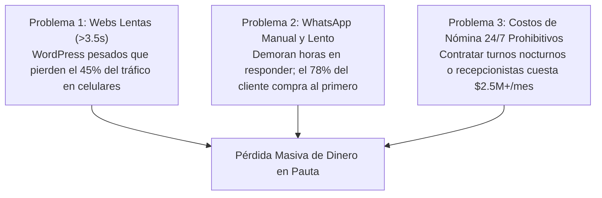
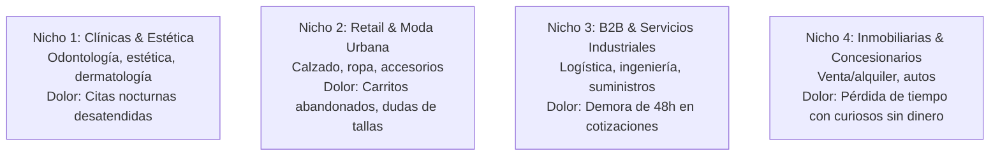
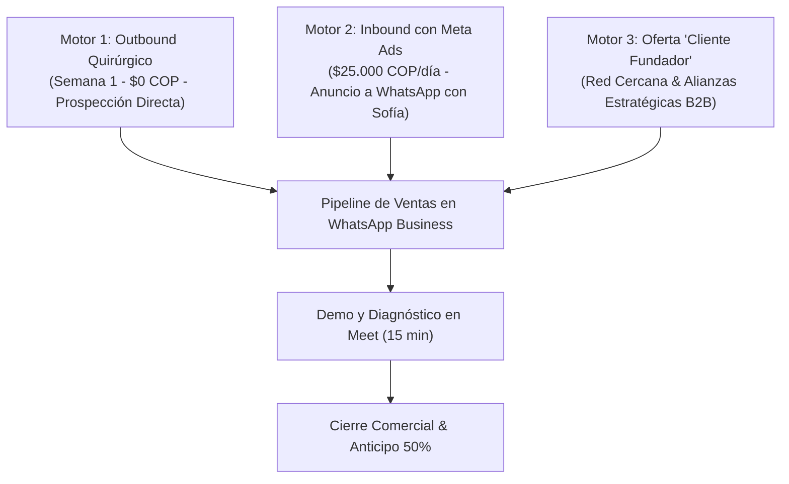
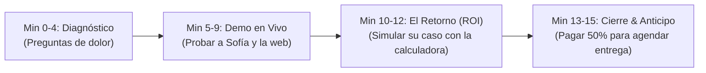
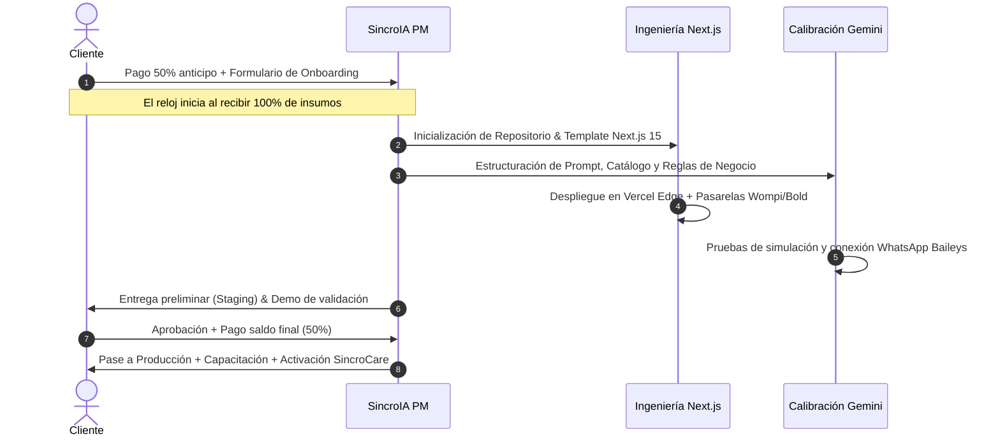
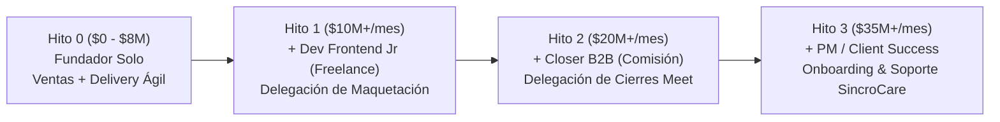
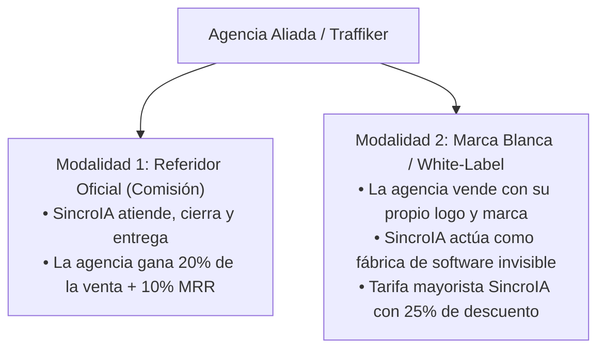

# 🚀 PLAN DE NEGOCIOS Y PLAYBOOK ESTRATÉGICO
## SincroIA — Software de Alto Rendimiento & Automatización con IA

**Versión:** 1.0 (Oficial)  
**Fecha de Actualización:** Septiembre 2026  
**Sede Principal:** Bogotá, Colombia  
**Cobertura:** Colombia y Latinoamérica  
**Dominio Oficial:** [https://www.sincroia.lat](https://www.sincroia.lat)  
**Contacto Oficial:** +57 312 463 0488  

---

## ÍNDICE GENERAL

1. [Resumen Ejecutivo & Tesis de Inversión](#1-resumen-ejecutivo--tesis-de-inversión)
2. [El Problema de Mercado & Oportunidad](#2-el-problema-de-mercado--oportunidad)
3. [Propuesta de Valor & Ventaja Competitiva Injusta](#3-propuesta-de-valor--ventaja-competitiva-injusta)
4. [Arquitectura de Servicios & Modelo de Monetización](#4-arquitectura-de-servicios--modelo-de-monetización)
5. [Estrategia de Ingresos Recurrentes (MRR - SincroCare)](#5-estrategia-de-ingresos-recurrentes-mrr---sincrocare)
6. [Unit Economics & Estructura de Márgenes](#6-unit-economics--estructura-de-márgenes)
7. [Perfil de Cliente Ideal (ICP) & Nichos Clave](#7-perfil-de-cliente-ideal-icp--nichos-clave)
8. [Estrategia Go-To-Market & Los 3 Motores de Adquisición](#8-estrategia-go-to-market--los-3-motores-de-adquisición)
9. [Guiones de Prospección Fría (Listos para Enviar)](#9-guiones-de-prospección-fría-listos-para-enviar)
10. [Framework de Cierre en Meet (15 Minutos) & Manejo de Objeciones](#10-framework-de-cierre-en-meet-15-minutos--manejo-de-objeciones)
11. [Gestión Comercial, Pipeline en WhatsApp & Rutina Diaria](#11-gestión-comercial-pipeline-en-whatsapp--rutina-diaria)
12. [Modelo Operativo, Stack Técnico & Entrega Ágil](#12-modelo-operativo-stack-técnico--entrega-ágil)
13. [Proyección Financiera a 12 Meses](#13-proyección-financiera-a-12-meses)
14. [Gestión de Riesgos & Blindaje Jurídico](#14-gestión-de-riesgos--blindaje-jurídico)
15. [Plan de Escalabilidad, Delegación & Contratación por Hitos](#15-plan-de-escalabilidad-delegación--contratación-por-hitos)
16. [Programa de Partners & Marca Blanca para Agencias (SincroPartners B2B)](#16-programa-de-partners--marca-blanca-para-agencias-sincropartners-b2b)

---

## 1. RESUMEN EJECUTIVO & TESIS DE INVERSIÓN

### 1.1 ¿Qué es SincroIA?
**SincroIA** es una agencia tecnológica especializada en **ingeniería de software de alto impacto y automatización con agentes autónomos de Inteligencia Artificial**. 

A diferencia de agencias de marketing digital tradicionales (que venden publicidad sin solucionar la operatividad de los negocios) o software houses pesadas (con tarifas fuera del alcance de las pymes), SincroIA construye **ecosistemas digitales llave en mano**: portales web nativos en Next.js 15 que abren en menos de 0.8 segundos y asistentes de IA conversacional (Gemini) en WhatsApp que califican prospectos, entregan presupuestos y agendan citas 24/7 sin descanso.

### 1.2 Misión y Visión
* **Misión:** Eliminar la fricción operativa y el abandono de prospectos en empresas de habla hispana mediante software ultra veloz y agentes de IA autónomos que convierten visitas en dinero real.
* **Visión a 3 Años:** Convertirnos en la firma de referencia en automatización con IA y desarrollo web moderno para más de 300 medianas empresas en Colombia, México y la región andina, consolidando una base de ingresos recurrentes (MRR) superior a los $50.000.000 COP mensuales.

---

## 2. EL PROBLEMA DE MERCADO & OPORTUNIDAD

En Colombia y América Latina existen más de 1.8 millones de empresas formales. El 90% enfrenta tres problemas críticos y costosos:



1. **Lentitud Web en Móviles:** La mayoría de empresas tienen páginas construidas en WordPress/Elementor con plugins saturados que tardan más de 3 segundos en abrir en celulares. En campañas de Instagram y Facebook Ads, cada segundo extra de carga reduce las ventas en un 20%.
2. **Pérdida de Prospectos en WhatsApp por Espera:** El 78% de los compradores en internet cierran con el primer negocio que les responde. Cuando una consulta llega después de las 6:00 PM o un domingo, el cliente busca a la competencia.
3. **El Costo Imposible de la Nómina 24/7:** Contratar una recepcionista o asesor de ventas en Colombia cuesta como mínimo un salario mínimo legal + prestaciones + recargos nocturnos y dominicales (**~$2.200.000 a $2.800.000 COP/mes por persona**), y solo cubre un turno de 8 horas. Un Agente de IA de SincroIA atiende a 50 clientes en paralelo, no descansa nunca y cuesta una fracción mensual.

---

## 3. PROPUESTA DE VALOR & VENTAJA COMPETITIVA INJUSTA

| Variable | Agencias Tradicionales | Creadores de Bots Baratos (Chatfuel/ManyChat) | **SincroIA.lat** |
|---|---|---|---|
| **Tecnología Web** | WordPress lento, plantillas pesadas | No ofrecen web | **Next.js 15, Vercel Edge (< 0.8s)** |
| **Cerebro del Bot** | No implementan IA real | Menús rígidos con botones *(«Presione 1»)* | **LLM Generativo (Gemini Flash)** con lenguaje natural y catálogo |
| **Atención en WhatsApp** | Manual por humanos | Rígida y propensa a fallar | **Respuestas en < 2s con Relevo Humano automático** |
| **Cobros & Pasarelas** | Woocommerce lento o Shopify con comisiones | Enlaces externos genéricos | **Integración nativa Wompi, Bold, PSE, Nequi (0% comisiones de plataforma)** |
| **Propiedad del Código** | Cautivos en plugins de terceros | Plataforma rentada | **100% propiedad del cliente sin ataduras** |
| **Precio de Entrada** | $8.000.000 - $15.000.000 COP | $300.000 COP (inútil para ventas complejas) | **$1.890.000 - $4.890.000 COP (Equilibrio perfecto de alto valor)** |

---

## 4. ARQUITECTURA DE SERVICIOS & MODELO DE MONETIZACIÓN

SincroIA opera con un modelo dual: **Tarifa de Implementación Inicial (Cash Flow inmediato)** + **Mantenimiento Recurrente Mensual (MRR para estabilidad financiera)**.

### 4.1 Paquetes Principales (Pago Único de Entrada)

#### 1. Plan Web Base — $1.890.000 COP
* **Dirigido a:** Empresas que necesitan presencia digital rápida, profesional y con máxima velocidad para pauta.
* **Incluye:**
  * Portal web a medida en Next.js 15 y Tailwind CSS.
  * Arquitectura optimizada para carga < 0.8s en celulares (Edge Computing).
  * Dominio profesional .com o .co por 1 año incluido.
  * Configuración técnica SEO inicial para indexación en Google.
  * Entrega ágil: **5 a 7 días hábiles** tras recepción de insumos y accesos.

#### 2. Plan Agente IA Pro — $2.490.000 COP
* **Dirigido a:** Negocios que ya tienen tráfico o mensajes diarios pero pierden ventas por demoras en la respuesta manual.
* **Incluye:**
  * Agente de IA entrenado con el catálogo, preguntas frecuentes y políticas de la empresa.
  * Conexión a WhatsApp Business (Multi-Device) y widget web.
  * Calificación automática de prospectos y agendamiento en Google Calendar.
  * Protocolo de Relevo Humano (si el asesor escribe, la IA se silencia 2 horas automáticamente).
  * Alertas push de compra al celular del dueño.
  * Entrega ágil: **7 a 10 días hábiles** tras recepción de catálogo y vinculación de WhatsApp.

#### 3. Plan E-commerce Pro — $3.690.000 COP
* **Dirigido a:** Marcas de moda, calzado, tecnología o retail que quieren vender online sin pagar comisiones mensuales a Shopify o pasarelas extranjeras.
* **Incluye:**
  * Tienda online transaccional de ultra alta velocidad.
  * Pasarelas Colombia: Wompi (Bancolombia), Bold, PSE, Nequi y Tarjetas.
  * Botón de compra asistida directo a WhatsApp con resumen de pedido.
  * Cero comisiones de plataforma por venta realizada.
  * Entrega ágil: **12 a 15 días hábiles** tras recepción de catálogo y aprobación de pasarelas.

#### 4. Plan Ecosistema Total (Paquete Insignia) — $4.890.000 COP
* **Dirigido a:** Empresas que buscan transformar completamente su canal comercial digital.
* **Incluye:**
  * Portal Web Ultra Veloz + Agente de IA para WhatsApp + Pasarela de pagos o cotizador dinámico.
  * Sincronización completa: cada visitante web puede continuar la compra en WhatsApp.
  * Soporte prioritario y capacitación privada de entrega.
  * Entrega integral: **15 a 20 días hábiles** tras recepción de insumos completos.
  * *(Ahorro comercial de $700.000 COP frente a contratar los servicios por separado).*

---

### 4.2 Módulos Adicionales (Upselling de Alto Margen)
Los módulos se venden como complementos en el formulario de cotización:
* **Facturación Electrónica DIAN Automática (Siigo/Alegra/Factus):** +$850.000 COP
* **Agente IA para Instagram DM y Facebook Messenger:** +$750.000 COP
* **Pasarelas de Pago Colombia (Wompi/Bold/PSE):** +$590.000 COP
* **Sistema de Citas y Reservas Sincronizado:** +$490.000 COP
* **CRM y Base de Datos Automatizada en Google Sheets:** +$490.000 COP
* **Gestor de Blog y Contenidos SEO:** +$550.000 COP
* **Sistema Multi-idioma (Español / Inglés):** +$450.000 COP
* **Sistema de Suscripciones y Cobros Recurrentes:** +$690.000 COP

---

## 5. ESTRATEGIA DE INGRESOS RECURRENTES (MRR - SINCROCARE)

Para evitar la trampa de las agencias de depender exclusivamente de vender proyectos nuevos cada mes, todo cliente pasa a formar parte de **SincroCare**.

### 5.1 Los 3 Tiers Escalonados de SincroCare (Por Volumen y Tráfico)

| Nivel | Inversión Mensual | Volumen de Mensajes IA | Servidor Cloud & Hosting | Soporte & Mantenimiento |
|---|:---:|:---:|:---:|---|
| 🥉 **Starter**<br>*(Estándar)* | **$190.000 COP/mes** | Hasta **5.000 chats/mes** | Servidor Cloud 24/7 + Hosting Edge 99.9% | 1 ajuste mensual de catálogo, reconexión de sesión y monitoreo. |
| 🥈 **Growth**<br>*(Pauta Activa)* | **$350.000 COP/mes** | Hasta **20.000 chats/mes** | Instancia cloud optimizada para picos | 2 ajustes mensuales de catálogo, alertas push de compra y soporte en < 4h. |
| 🥇 **Enterprise**<br>*(Alto Volumen)* | **$590.000 COP/mes** | **Chats Ilimitados** | Servidor exclusivo de alto rendimiento | Soporte VIP en < 1 hora, recalibración quincenal y reportes de conversión. |

> **Condición Comercial:** Todo paquete de implementación incluye el **primer mes de SincroCare Starter 100% GRATIS**. A partir del día 31, el cliente continúa en su nivel correspondiente según su volumen de atención.

---

## 6. UNIT ECONOMICS & ESTRUCTURA DE MÁRGENES

La ventaja de la arquitectura moderna (Next.js serverless + Gemini API) es que los costos variables por cliente son extremadamente bajos:

### 6.1 Costos Directos por Cliente de SincroCare ($190.000 COP/mes)

| Rubro de Costo | Costo Estimado en USD | Costo en COP (TRM 4.000) |
|---|---|---|
| Hosting Edge Web (Vercel Hobby/Pro distribuido) | $0.50 USD | ~$2.000 COP |
| Servidor VPS/Docker WhatsApp (Railway/Render) | $3.50 USD | ~$14.000 COP |
| Consumo Tokens IA (Gemini 3.6 Flash ~5.000 chats) | $1.50 USD | ~$6.000 COP |
| Margen de seguridad operativa | $1.00 USD | ~$4.000 COP |
| **COSTO TOTAL DIRECTO MENSUAL** | **$6.50 USD** | **~$26.000 COP** |
| **PRECIO DE VENTA SINCROCARE** | **$47.50 USD** | **$190.000 COP** |
| **MARGEN BRUTO MENSUAL POR CLIENTE** | **$41.00 USD** | **$164.000 COP (86.3% de Margen)** |

> [!TIP]
> **Poder del MRR:** Con 25 clientes activos en SincroCare, la agencia genera **$4.750.000 COP/mes** de facturación recurrente con más de **$4.100.000 COP de utilidad bruta**, cubriendo costos fijos operativos antes de vender un solo proyecto nuevo.

---

## 7. PERFIL DE CLIENTE IDEAL (ICP) & NICHOS CLAVE

No le vendemos a todo el mundo. Nos enfocamos en 4 nichos que ya tienen demanda y flujo de caja diario:



### Criterios de Calificación de Prospectos (Filtro Anti-Clientes Tóxicos):
* ✅ Facturación mensual demostrable superior a $15.000.000 COP.
* ✅ Invierten activamente en publicidad digital (Meta Ads o Google Ads) o tienen un flujo de al menos 15-20 mensajes diarios en WhatsApp.
* ✅ Venden productos o servicios con ticket promedio superior a $100.000 COP.
* ❌ **Descartar:** Emprendedores sin presupuesto que buscan "un logo barato" o que pretenden regatear precios por debajo de $1.89M.

---

## 8. ESTRATEGIA GO-TO-MARKET & LOS 3 MOTORES DE ADQUISICIÓN

Para escalar la facturación sin depender de la suerte o de que alguien encuentre la web por casualidad, SincroIA opera con **3 motores comerciales simultáneos**:



### Motor 1: Outbound Quirúrgico ("La Auditoría de 60 Segundos")
* **Objetivo:** Generar los primeros ingresos de inmediato con $0 de inversión en pauta.
* **Proceso de Prospección:**
  1. Identificar en Instagram o Facebook Ad Library 10 empresas de tu ciudad que estén pagando publicidad en los nichos clave (clínicas odontológicas/estéticas, tiendas de calzado/moda o empresas B2B).
  2. Abrir su enlace web desde el celular y medir el tiempo de carga.
  3. Escribir a su WhatsApp a las 7:30 PM para medir su tiempo de respuesta manual.
  4. Enviar un mensaje personalizado no invasivo ofreciéndoles un video de 45 segundos con el diagnóstico exacto.
* **Métrica de conversión esperada:**
  * 10 mensajes diarios = 50 a la semana.
  * 12 a 15 respuestas positivas.
  * 4 a 5 diagnósticos agendados.
  * **1 a 2 cierres semanales ($2.49M a $4.89M COP facturados por semana)**.

### Motor 2: Inbound con "Efecto Demostración" (Meta Ads a WhatsApp)
* **Presupuesto recomendado:** $20.000 a $30.000 COP / día.
* **El Anuncio:** Video corto mostrando la pantalla del celular:
  > *«¿Tu equipo tarda horas en responder WhatsApp y pierdes ventas en las noches? Mira cómo Sofía atiende en 1.8 segundos, califica el presupuesto del cliente y agenda citas en automático. Toca el botón, escríbele ahora mismo y ponla a prueba en vivo.»*
* **Por qué es imbatible:** En lugar de prometer en una landing estática, el cliente experimenta la tecnología en su propio WhatsApp. Sofía se encarga de venderse a sí misma, responder preguntas y filtrar el interés del prospecto antes de transferirlo al fundador para cerrar.
* **Costo por conversación iniciada:** ~$1.500 a $3.000 COP en Colombia. Con $25.000 COP diarios se generan entre 8 y 15 conversaciones con dueños de negocio al día.

### Motor 3: Oferta "Cliente Fundador" para Red Cercana
* **Objetivo:** Conseguir los primeros 3 casos de éxito documentados en los primeros 10 días.
* **La Oferta:**
  > *"Estamos seleccionando a 3 empresas aliadas para implementarles nuestro Agente de IA para WhatsApp con un 30% de descuento y el primer mes de mantenimiento en la nube GRATIS, a cambio de que nos permitan documentar sus métricas y grabar un testimonio corto de 30 segundos tras los primeros 30 días."*
* Esto remueve cualquier fricción de precio y activa de inmediato ingresos recurrentes en SincroCare.

---

## 9. GUIONES DE PROSPECCIÓN FRÍA (LISTOS PARA ENVIAR)

### Guion 1: Sector Clínicas Dentales & Medicina Estética
> *"Hola [Nombre del Doctor o Clínica], un gusto saludarte. Vi que tienen campañas activas en Instagram ofreciendo [Tratamiento / Valoración], pero al consultar por WhatsApp después de las 7:00 PM no encontré atención automática para apartar cita.*  
> *En clínicas similares, hasta el 55% de los pacientes consultan de noche y el 70% termina agendando con el primer consultorio que les responde de inmediato.*  
> *Les grabé un video rápido de 45 segundos mostrando cómo un Agente de IA califica el tratamiento y sincroniza la cita directo en Google Calendar en 1.8 segundos. ¿A qué número o correo les puedo compartir el video sin compromiso?"*

### Guion 2: Sector Retail & E-commerce de Moda / Calzado
> *"Hola equipo de [Marca], felicitaciones por la colección que tienen en pauta. Noté que al abrir su tienda desde el celular tarda más de 4 segundos en cargar el catálogo, y en móviles cada segundo de espera causa hasta un 30% de carritos abandonados.*  
> *En SincroIA desarrollamos tiendas en Next.js que cargan en menos de 0.8 segundos con botón de cobro directo a Wompi/Nequi y compra asistida por WhatsApp.*  
> *Si les interesa, les comparto una auditoría rápida de 1 minuto con las 3 mejoras técnicas clave para duplicar la retención de sus campañas. ¿Les gustaría revisarla?"*

### Guion 3: Sector B2B & Servicios Industriales / Logística
> *"Hola [Nombre], qué tal. Noté que para cotizar sus servicios de [Servicio específico] los clientes deben enviar un formulario y esperar entre 24 y 48 horas una respuesta por correo.*  
> *Hoy en día los compradores corporativos cierran con el proveedor más ágil. Implementamos portales con cotizador dinámico paramétrico y Agentes de IA que entregan un presupuesto preliminar y agendan reunión por Meet en menos de 10 segundos.*  
> *¿Tendrías 10 minutos esta semana para mostrarte cómo funciona en vivo con un caso real de tu sector?"*

---

## 10. FRAMEWORK DE CIERRE EN MEET (15 MINUTOS) & MANEJO DE OBJECIONES

Las reuniones comerciales no deben ser charlas largas de 1 hora que aburren al cliente. Se cierran en **15 a 20 minutos** siguiendo esta estructura estricta:



1. **Minutos 0 a 4 (Diagnóstico y Cuello de Botella):**  
   * *«¿Cuántos mensajes o visitas reciben hoy al día?»*  
   * *«¿Qué pasa cuando alguien escribe a las 9:00 PM o un domingo?»*  
   * *«¿Cuánto tiempo le toma a tu equipo responder y cotizar?»*
2. **Minutos 5 a 9 (Demostración de Impacto en Vivo):**  
   * Compartir pantalla: mostrar la web de SincroIA cargando al instante en celular.
   * Abrir WhatsApp y hacer que el cliente mismo le escriba una pregunta real a Sofía. Dejar que el cliente se sorprenda con la respuesta en 1.8 segundos.
3. **Minutos 10 a 12 (El Retorno de Inversión):**  
   * Abrir la Calculadora de ROI en `sincroia.lat#calculadora-roi` con los números del cliente:  
     *«Si recibes 300 mensajes al mes con un ticket de $150.000 COP y tardas 1 hora en responder, estás perdiendo cerca de $2.500.000 COP mensuales. El plan IA Pro cuesta $2.490.000 COP pago único. Se paga solo en el primer mes.»*
4. **Minutos 13 a 15 (Llamado a la Acción y Cierre):**  
   * *«Podemos iniciar tu implementación mañana mismo y tenerlo funcionando en tu WhatsApp en 10 a 12 días hábiles. Iniciamos con el 50% de anticipo y el saldo contra entrega. ¿Prefieres hacer la transferencia por Bancolombia, Wompi o PSE?»*

### Respuestas Maestras a Objeciones:
* **Objeción 1: *"Es que ya tenemos una persona atendiendo el WhatsApp."***  
  * *Respuesta:* «Excelente, y esa persona es indispensable para cerrar los clientes grandes. El problema es que una persona no puede atender a 5 clientes a la vez ni responde a medianoche. Nuestro bot filtra a los curiosos, responde horarios y precios, y le entrega a tu asesor solo a los clientes calificados con intención de compra. Es un asistente para multiplicar sus ventas, no para reemplazarla.»
* **Objeción 2: *"Me parece costoso comparado con otras opciones de $500.000."***  
  * *Respuesta:* «Totalmente comprensible fijarse en el costo inicial. Esas opciones baratas son bots antiguos de botones rígidos ('Presione 1 o 2') que enfurecen a los clientes y no entienden lenguaje natural. SincroIA implementa IA generativa con el catálogo completo de tu empresa y código propio. Con solo 2 ventas extras que recuperes en una noche, la inversión queda pagada.»
* **Objeción 3: *"¿Y si el bot se equivoca o inventa información?"***  
  * *Respuesta:* «Programamos guardarraíles técnicos estrictos: la IA solo responde lo que esté en tu dossier oficial autorizado. Si le preguntan algo fuera de catálogo, dice con educación: 'Ese detalle específico prefiero consultarlo con un especialista del equipo; ya mismo te pongo en contacto'. Y si tú escribes en el chat, el bot se silencia al instante gracias al protocolo de relevo humano.»

---

## 11. GESTIÓN COMERCIAL, PIPELINE EN WHATSAPP & RUTINA DIARIA

Para gestionar los prospectos sin pagar costosos CRMs en la etapa inicial, se utiliza el sistema de **Etiquetas de WhatsApp Business**:

### Las 4 Etiquetas del Embudo:
* 🟡 **Amarillo - Nuevo Prospecto:** El usuario escribió por primera vez o hizo clic en el anuncio. Sofía está en conversación activa.
* 🔵 **Azul - Calificado / Interesado:** El prospecto ya confirmó volumen de mensajes, presupuesto y solicitó cotización.
* 🟣 **Morado - Demo Agendada (Meet):** Tiene videollamada programada en Google Calendar para ver la propuesta.
* 🟢 **Verde - Cliente Ganado (Anticipo 50% Pagado):** Se envía el formulario de onboarding y se asigna fecha de entrega en el cronograma.

### La Rutina Diaria del Fundador / Director Comercial:
* **09:00 AM – 10:30 AM (Bloque Sagrado de Prospección):** Enviar 10 mensajes de auditoría en frío por Instagram a negocios calificados.
* **10:30 AM – 12:30 PM (Seguimiento y Chats Calientes):** Revisar las conversaciones donde Sofía detectó interés y responder dudas avanzadas.
* **02:30 PM – 05:00 PM (Llamadas de Cierre en Meet):** Ejecutar las demos de 15 minutos agendadas y enviar enlaces de pago de anticipo por Bancolombia/Wompi.
* **05:00 PM – 06:00 PM (Supervisión Operativa):** Revisar avances técnicos de entregas y calibración de prompts.

---

## 12. MODELO OPERATIVO, STACK TÉCNICO & ENTREGA ÁGIL

Para mantener márgenes altos y relaciones comerciales saludables, la entrega de cada proyecto está estandarizada según el plan contratado y su nivel de complejidad técnica.

### 12.1 Matriz Oficial de Tiempos de Entrega por Plan y Complejidad

| Plan | Complejidad Técnica | Tiempo de Entrega Estimado | Hito Crítico de Inicio |
|---|:---:|:---:|---|
| **1. Web Base** ($1.890.000) | 🟢 **Baja** | **5 a 7 días hábiles** (~1 semana) | Entrega de logo, textos, fotos y secciones aprobadas. |
| **2. Agente IA Pro** ($2.490.000) | 🟡 **Media** | **7 a 10 días hábiles** (~1.5 a 2 semanas) | Carga de catálogo/precios y escaneo de QR WhatsApp. |
| **3. E-commerce Pro** ($3.690.000) | 🟠 **Media - Alta** | **12 a 15 días hábiles** (~2.5 a 3 semanas) | Catálogo de productos y aprobación de cuenta Wompi/Bold. |
| **4. Ecosistema Total** ($4.890.000) | 🔴 **Alta** | **15 a 20 días hábiles** (~3 a 4 semanas) | Entrega integral de insumos, web + IA + pasarelas. |

### 12.2 Factores que Modifican los Tiempos de Entrega (Módulos Complejos)
Cuando el cliente contrata módulos adicionales, los plazos se ajustan de forma transparente en la cotización:
* **Facturación Electrónica DIAN (Siigo / Factus / Alegra):** **+3 a 5 días hábiles** *(sujeto a que el cliente disponga de software contable activo y suministre las credenciales API)*.
* **Catálogos Extensos (> 50 SKUs en E-commerce):** **+3 a 5 días hábiles** *(o se entrega la tienda con 30 productos y plantilla de importación masiva en CSV)*.
* **Integración Omnicanal (Instagram DM + Messenger):** **+2 a 3 días hábiles** *(sujeto a permisos de administrador en Meta Business Suite)*.
* **Sistema Multi-idioma:** **+2 días hábiles**.

### 12.3 Cláusula de Protección Operativa: "El Reloj del Cliente"
> **Regla de Oro:** Los días hábiles de entrega comienzan a contabilizarse **únicamente a partir del momento en que el cliente entrega el 100% de los insumos mínimos obligatorios** (formulario de onboarding diligenciado, catálogo con precios, logo y acceso a su WhatsApp o pasarela).  
> Si el cliente demora 5 días en responder o enviar sus contenidos, el cronómetro de entrega de la agencia queda **automáticamente suspendido** hasta la recepción efectiva del material.



### Reglas Operativas Financieras:
* **Anticipo 50% / Saldo 50% contra entrega:** Nunca se inicia desarrollo sin el 50% de anticipo. Las llaves finales del dominio, código y accesos se transfieren exclusivamente contra la cancelación del 100%.
* **Rondas de Ajustes:** La entrega preliminar incluye hasta **2 rondas de revisiones menores** dentro del alcance contratado, las cuales deben ser comunicadas por el cliente en un plazo máximo de 5 días hábiles.
* **Procedimiento Operativo Estandarizado (SOP Completo):** El paso a paso detallado desde la prospección, kit de onboarding de insumos, línea de ensamblaje, capacitación 1 a 1 y plantillas de mensajes oficiales se encuentra documentado en [**`docs/PROTOCOLO_FLUJO_CLIENTE_SINCROIA.md`**](./PROTOCOLO_FLUJO_CLIENTE_SINCROIA.md).
* **Manual de Operaciones, Soporte, Seguridad y Finanzas (SOP):** Los protocolos de freno a peticiones infinitas (*Scope Creep*), acuerdos de nivel de servicio (SLA), custodia de credenciales, programa de referidos del Día 21 y la regla financiera 50/30/20 se encuentran detallados en [**`docs/MANUAL_DE_OPERACIONES_Y_PROTOCOLOS_SINCROIA.md`**](./MANUAL_DE_OPERACIONES_Y_PROTOCOLOS_SINCROIA.md).
* **Infraestructura Cloud 24/7 & Boilerplate de Despliegue Rápido (< 2 Horas):** La arquitectura profesional dual (Meta Cloud API vs Evolution Docker con Redis) y el template de aprovisionamiento ágil se detallan en [**`docs/ARQUITECTURA_FARM_CLIENTES_BOILERPLATE.md`**](./ARQUITECTURA_FARM_CLIENTES_BOILERPLATE.md).
* **Reporte de Impacto Mensual (Día 28) & Cobranza Amigable:** Las métricas de retención, cálculo de nómina ahorrada y mensajes amigables se encuentran en [**`docs/PLANTILLA_REPORTE_IMPACTO_SINCROCARE.md`**](./PLANTILLA_REPORTE_IMPACTO_SINCROCARE.md).

---

## 13. PROYECCIÓN FINANCIERA A 12 MESES

Proyección financiera realista basada en una meta de adquisición conservadora de **3 a 6 proyectos mensuales** y retención en SincroCare del 80%:

### Métricas de Proyección (En Pesos Colombianos - COP)

| Mes | Nuevos Proyectos | Facturación Proyectos | Clientes SincroCare Activos | Facturación Recurrente (MRR) | **Facturación Total Mes** | Utilidad Bruta Estimada (~85%) |
|:---:|:---:|:---:|:---:|:---:|:---:|:---:|
| **Mes 1** | 2 proyectos ($2.49M + $1.89M) | $4.380.000 | 0 (Mes gratis) | $0 | **$4.380.000** | $3.723.000 |
| **Mes 2** | 3 proyectos | $8.670.000 | 2 | $380.000 | **$9.050.000** | $7.692.500 |
| **Mes 3** | 4 proyectos | $11.560.000 | 5 | $950.000 | **$12.510.000** | $10.633.500 |
| **Mes 4** | 4 proyectos | $12.300.000 | 8 | $1.520.000 | **$13.820.000** | $11.747.000 |
| **Mes 5** | 5 proyectos | $15.400.000 | 11 | $2.090.000 | **$17.490.000** | $14.866.500 |
| **Mes 6** | 5 proyectos | $16.200.000 | 15 | $2.850.000 | **$19.050.000** | $16.192.500 |
| **Mes 7** | 6 proyectos | $18.900.000 | 19 | $3.610.000 | **$22.510.000** | $19.133.500 |
| **Mes 8** | 6 proyectos | $19.500.000 | 23 | $4.370.000 | **$23.870.000** | $20.289.500 |
| **Mes 9** | 6 proyectos | $20.100.000 | 27 | $5.130.000 | **$25.230.000** | $21.445.500 |
| **Mes 10** | 7 proyectos | $23.400.000 | 31 | $5.890.000 | **$29.290.000** | $24.896.500 |
| **Mes 11** | 7 proyectos | $24.000.000 | 35 | $6.650.000 | **$30.650.000** | $26.052.500 |
| **Mes 12** | 8 proyectos | $27.500.000 | 40 | $7.600.000 | **$35.100.000** | $29.835.000 |
| **TOTAL AÑO 1** | **63 proyectos** | **$201.910.000 COP** | **40 retenciones** | **$41.040.000 COP** | **$242.950.000 COP** | **~$206.500.000 COP** |

---

## 14. GESTIÓN DE RIESGOS & BLINDAJE JURÍDICO

Para garantizar la viabilidad a largo plazo de SincroIA en el marco legal colombiano:

1. **Cumplimiento de Habeas Data (Ley 1581 de 2012):**  
   Todo lead capturado en la web o por WhatsApp cuenta con la casilla de aceptación obligatoria de políticas de privacidad.
2. **Prevención de Bloqueos de WhatsApp Business:**  
   No realizamos envíos masivos de spam no solicitados (*outbound spam*). Sofía responde exclusivamente a **inbound** (usuarios que inician la conversación por iniciativa propia tras ver un anuncio o entrar a la web), operando 100% dentro de las directrices de Meta.
3. **Contratos de Servicios de Software:**  
   Todo cliente firma un acuerdo de alcance técnico detallando qué incluye el proyecto, plazos de entrega y aclarando que las integraciones con APIs externas (Google, Meta, pasarelas) están sujetas a la disponibilidad de sus respectivos proveedores.

---

## 15. PLAN DE ESCALABILIDAD, DELEGACIÓN & CONTRATACIÓN POR HITOS

El mayor riesgo de una agencia de desarrollo y automatización de alto rendimiento es el **cuello de botella del fundador** (*solopreneur trap*): cuando el fundador vende, programa, atiende el soporte y cobra, la capacidad máxima se satura en 3 a 5 clientes mensuales, frenando el crecimiento.

Para escalar de forma rentable y ordenada sin inflar costos fijos antes de tiempo, SincroIA implementa un **modelo de delegación gatillado por hitos de facturación mensual sostenida (durante al menos 60 días consecutivos)**:



### 15.1 Matriz de Contratación Escalonada por Hitos

| Hito Financiero | Rol a Incorporar | Modalidad & Remuneración | Responsabilidades Clave | Horas Liberadas para el Fundador |
|:---:|---|---|---|:---:|
| **Hito 0**<br>*(Etapa Semilla)*<br>Hasta **$8M COP/mes** | **Fundador / Operador Único** | 100% Utilidad neta reinvertible | • Prospección activa y llamadas de cierre.<br>• Ensamblaje modular en Next.js y calibración de prompts Gemini.<br>• Despliegues en Vercel y vinculación de WhatsApp. | 0 h (Fase de tracción y validación) |
| **Hito 1**<br>*(Primer Cuello de Botella)*<br>**$10M COP/mes** sostenido | **Desarrollador Frontend Junior / Integrador** | Contrato de prestación de servicios por proyecto:<br>**$700.000 a $1.100.000 COP** por sitio web entregado | • Clonación y maquetación de componentes visuales en Tailwind.<br>• Carga de catálogos de productos (CSV/Sheets).<br>• Pruebas de responsividad móvil y verificación de enlaces.<br>• El fundador mantiene la arquitectura de IA y la relación con el cliente. | **15 - 20 horas / semana** (Permite duplicar la prospección comercial) |
| **Hito 2**<br>*(Expansión Comercial)*<br>**$20M COP/mes** sostenido | **Closer Comercial B2B** | Sueldo base de apoyo ($800.000 COP) + **Comisión del 10% al 15%** sobre cada proyecto cerrado y cobrado | • Conducción de las sesiones de Meet de 15 minutos (diagnóstico y cierre).<br>• Seguimiento del pipeline de WhatsApp y reactivación de cotizaciones.<br>• El fundador pasa a ser Director de Operaciones y Estrategia. | **15 horas / semana** (El fundador ya no atiende llamadas rutinarias) |
| **Hito 3**<br>*(Institucionalización)*<br>**$35M - $50M COP/mes** | **Project Manager (PM) & Soporte SincroCare** | Salario fijo: **$1.800.000 a $2.400.000 COP/mes** + bono por retención de MRR | • Gestión del formulario de onboarding y recolección de insumos con el cliente.<br>• Control del cronómetro de entrega ("El Reloj del Cliente").<br>• Atención de tickets de soporte SincroCare (< 4 horas).<br>• Protocolo de referidos del Día 21. | **20 horas / semana** (La operación corre en piloto automático) |

### 15.2 Distribución del Tiempo del Fundador en Cada Etapa

```
Hito 0 ($0 - $8M):     [ 40% Ventas/Prospección ] [ 50% Programación/Técnico ] [ 10% Admin ]
Hito 1 ($10M):          [ 60% Ventas/Prospección ] [ 25% Supervisión Técnica ]  [ 15% Admin ]
Hito 2 ($20M):          [ 40% Alianzas/Partners  ] [ 30% Supervisión Delivery ] [ 30% Estrategia ]
Hito 3 ($35M+):         [ 50% Estrategia/Scale   ] [ 30% Grandes Cuentas B2B  ] [ 20% Liderazgo ]
```

---

## 16. PROGRAMA DE PARTNERS & MARCA BLANCA PARA AGENCIAS (SINCROPARTNERS B2B)

### 16.1 La Oportunidad B2B Desatendida
En Colombia y Latinoamérica existen más de **4.500 agencias de marketing digital, traffikers independientes, community managers y diseñadores web** que enfrentan una debilidad crítica:
* Son expertos en correr pauta publicitaria en Meta Ads o Google Ads.
* **NO saben programar agentes autónomos de IA en WhatsApp ni webs de alto rendimiento en Next.js.**
* Sus clientes les reclaman: *"Los anuncios traen leads pero nadie responde a tiempo en WhatsApp y no vendo, voy a cancelar la pauta"*.

**SincroPartners** convierte a estas agencias en nuestro canal de distribución indirecto más potente, multiplicando las ventas de SincroIA sin gastar un solo peso en publicidad directa.

### 16.2 Las 2 Modalidades de Alianza SincroPartners



#### Modalidad 1: Afiliado / Referidor Oficial (Para creadores de contenido, consultores y traffikers)
* La agencia o consultor detecta que su cliente de pauta pierde ventas por no tener bot de WhatsApp o web veloz.
* Le presenta a SincroIA como su *socio tecnológico oficial*.
* SincroIA conduce el diagnóstico en Meet, cobra y ejecuta el proyecto.
* **Compensación a la agencia:**
  * **20% de comisión inmediata** sobre la tarifa de implementación cobrada ($378.000 a $978.000 COP por cliente).
  * **10% mensual recurrente** de la suscripción SincroCare mientras el cliente permanezca activo ($19.000 a $59.000 COP/mes por cliente de forma pasiva).

#### Modalidad 2: Marca Blanca / White-Label (Para agencias medianas que no quieren perder protagonismo)
* La agencia le ofrece a su cliente un *"Ecosistema Integral de Automatización"* bajo su propia identidad visual y nombre de agencia.
* SincroIA opera como su **departamento de tecnología invisible** (*behind the scenes*).
* SincroIA le factura a la agencia su tarifa base con un **25% de descuento mayorista**:
  * Plan Agente IA Pro: Tarifa SincroIA mayorista **$1.867.500 COP** (la agencia suele venderlo en $2.800.000 a $3.500.000 COP a su cliente, embolsándose un margen de hasta $1.600.000 COP limpios).
  * SincroCare Mayorista: **$140.000 COP/mes** (la agencia lo cobra a su cliente en $250.000 a $350.000 COP/mes).
* Toda la comunicación técnica la canaliza el PM de la agencia.

### 16.3 Guion de Prospección Fría para Directores de Agencia (LinkedIn / WhatsApp B2B)

> **Mensaje de Apertura (Directo y de Alto Valor):**  
> *"Hola [Nombre], vi los resultados de las campañas que corren en [Nombre de su Agencia], brutal el trabajo que hacen en pauta.*  
>  
> *Te escribo porque muchos media buyers y agencias amigas tienen el mismo dolor de cabeza: le llenan el WhatsApp de prospectos a los clientes, pero el equipo de ventas del cliente demora 3 horas en responder y terminan culpando a la pauta por las pocas ventas.*  
>  
> *Nosotros desarrollamos una infraestructura de agentes de IA en WhatsApp nativos para Next.js que responden y cotizan en menos de 2 segundos 24/7. Estamos operando como brazo tecnológico de marca blanca para agencias: ustedes se quedan con el cliente y el margen, y nosotros nos encargamos del software detrás de bambalinas.*  
>  
> *¿Te interesaría ver una demo de 3 minutos de cómo se ve funcionando para implementarlo en tus cuentas actuales?"*

### 16.4 Ventajas Estratégicas para SincroIA
1. **Costo de Adquisición de Clientes (CAC) = $0 COP:** Cada alianza con una agencia puede inyectar entre 2 y 5 clientes nuevos recurrentes cada trimestre.
2. **Volumen Predecible:** Las agencias ya tienen la cartera de clientes calientes pagando mensualmente; solo necesitan añadir este servicio adicional (*up-sell*).
3. **Blindaje de Cartera:** La tasa de retención (*churn rate*) de agencias en marca blanca es inferior al 5% porque cambiar de proveedor de software les implica riesgo técnico.

---

*Documento confidencial para uso operativo, comercial y de planeación de SincroIA.*
