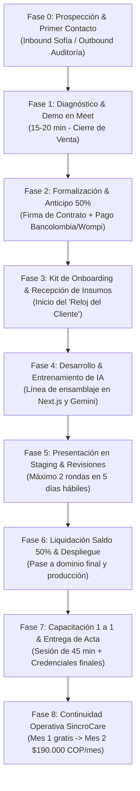
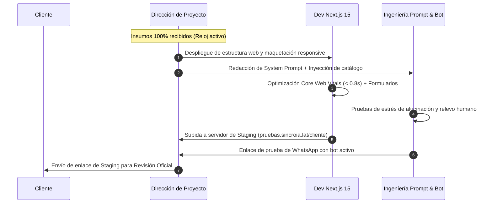

# 📋 PROTOCOLO OPERATIVO RIGUROSO: FLUJO INTEGRAL DEL CLIENTE (END-TO-END)
## SincroIA — Del Primer Contacto a la Retención Recurrente

**Propósito:** Este documento define el estándar operativo oficial (SOP) de SincroIA para guiar a cada cliente a través de una experiencia fluida, predecible, blindada legalmente y de altísima calidad técnica, desde el primer mensaje hasta el soporte continuo en SincroCare.

---

## 🗺️ MAPA GENERAL DEL FLUJO (8 FASES OPERATIVAS)

---

## FASE 0: PROSPECCIÓN & PRIMER CONTACTO

* **Objetivo:** Capturar el lead calificado y transferirlo a canal prioritario.
* **Canales de Entrada:**
  1. *Inbound Web / WhatsApp:* El cliente escribe al `+57 312 463 0488` o llena el formulario en `sincroia.lat`.
  2. *Outbound:* Mensaje de auditoría de 45 segundos enviado por Instagram o WhatsApp a negocios con pauta activa.
* **Actores:** Sofía IA (primeros 2 minutos) o Dirección General / Dirección de Ingeniería (Alejandro).
* **Entregable de la Fase:** Lead registrado en WhatsApp Business con etiqueta 🟡 **Amarillo (Nuevo Lead)** o 🔵 **Azul (Calificado)**.
* **SLA de Respuesta:** **Menos de 2 minutos** (si entra por web/WhatsApp) o respuesta en el mismo día comercial.

---

## FASE 1: DIAGNÓSTICO & DEMO EN VIVO (MEET DE 15-20 MIN)

* **Objetivo:** Presentar la solución a la medida, validar el dolor y cerrar la venta.
* **Estructura de la Reunión:**
  * **Minutos 0 a 4 (Diagnóstico):** Preguntar volumen de mensajes actuales, horarios de atención y ticket promedio.
  * **Minutos 5 a 9 (Demostración de Impacto):** Mostrar la web cargando en < 0.8s en celular y hacer que el cliente pruebe a Sofía en su propio teléfono en vivo.
  * **Minutos 10 a 12 (Simulación de ROI):** Abrir la calculadora en `sincroia.lat#calculadora-roi` y proyectar su retorno.
  * **Minutos 13 a 15 (Propuesta y Cierre):** Presentar el plan exacto (Web Base, IA Pro, E-commerce o Ecosistema Total) y solicitar el 50% de anticipo.
* **Etiqueta en WhatsApp:** 🟣 **Morado (Demo Agendada / Propuesta)**.

---

## FASE 2: FORMALIZACIÓN LEGAL & RECAUDO DEL ANTICIPO (50%)

* **Objetivo:** Blindar la relación contractual y recibir los fondos antes de iniciar cualquier desarrollo.
* **Pasos Operativos:**
  1. **Generación del Contrato:** Duplicar la plantilla oficial `docs/CONTRATO_MARCO_SERVICIOS_SINCROIA.md` completando:
     * Nombre del cliente y C.C. / NIT.
     * Plan contratado y módulos adicionales.
     * Plazo de entrega acordado en días hábiles.
     * Valor del anticipo (50%) y saldo final (50%).
  2. **Envío del Contrato:** Enviar en PDF para firma digital (DocuSign, PandaDoc, Adobe Sign o firma electrónica escaneada).
  3. **Recaudo del Anticipo:**
     * Métodos: Transferencia Bancolombia, enlace de Wompi (tarjetas/PSE) o transferencia Nequi.
     * Generación del comprobante de ingreso.
* **Regla Inquebrantable:** **Cero líneas de código escritas sin el 50% de anticipo confirmado en cuenta.**
* **Etiqueta en WhatsApp:** 🟢 **Verde (Cliente Ganado / Anticipo Pagado)**.

---

## FASE 3: KIT DE ONBOARDING & RECEPCIÓN OBLIGATORIA DE INSUMOS

> [!IMPORTANT]
> **AQUÍ INICIA "EL RELOJ DEL CLIENTE":**  
> El cronómetro de días hábiles pactado en el contrato **no empieza a correr con el pago del anticipo**, sino **a partir del día hábil siguiente a la recepción del 100% de los insumos obligatorios**.

Se envía al cliente el siguiente mensaje y enlace al **Formulario Oficial de Onboarding** (Google Form o Notion):

### 📦 Checklist Obligatorio de Insumos por Plan

#### A. Identidad Visual & Branding
* [ ] **Logo Principal:** Formato vectorial (.SVG, .AI) o PNG en alta resolución con fondo transparente.
* [ ] **Colores Corporativos:** Códigos hexadecimales (Ej: `#00E5FF`, `#030712`).
* [ ] **Tipografías:** Nombre de la fuente corporativa o archivos (.woff2 / .ttf).
* [ ] **Imágenes / Fotografías:** Carpeta de Google Drive con fotos reales de alta calidad (instalaciones, productos, equipo).

#### B. Dossier de Negocio para el Agente de IA (Plan IA Pro / Ecosistema)
* [ ] **Catálogo Oficial:** Lista estructurada en Excel o PDF con:
  * Nombre del producto o servicio.
  * Descripción clara y beneficios.
  * Precios en pesos colombianos ($ COP).
  * Promociones, combos o políticas de descuento vigentes.
* [ ] **Preguntas Frecuentes (FAQ Operativo):**
  * Horarios de atención y sedes físicas (dirección exacta).
  * Zonas de cobertura de envíos y costos de fletes.
  * Tiempos de entrega de productos o duración de citas.
  * Garantías, cambios y devoluciones.
  * Métodos de pago aceptados (Bancolombia, Nequi, PSE, contraentrega).
* [ ] **Políticas Críticas ("Qué NO puede decir el bot"):**
  * Límites de promesas comerciales.
  * Respuestas ante reclamos o quejas (protocolo de transferencia a un humano).

#### C. Credenciales y Accesos Técnicos
* [ ] **WhatsApp:** Definición del número de teléfono exclusivo para el bot (SIM card activa en un celular para escanear el código QR inicial).
* [ ] **Google Calendar:** Correo de Gmail corporativo donde se vinculará la agenda de citas.
* [ ] **Dominio Web (si ya lo tienen):** Acceso a GoDaddy, Namecheap o panel de DNS para apuntar los registros `A` y `CNAME` a Vercel. *(Si no tienen dominio, SincroIA lo adquiere y configura).*
* [ ] **Pasarelas de Pago (E-commerce):** Llaves API públicas y privadas de Wompi, Bold o MercadoPago.

---

## FASE 4: LÍNEA DE ENSAMBLAJE & DESARROLLO (SPRINT DE INGENIERÍA)

Una vez validados todos los insumos, el equipo ejecuta el sprint en 4 estaciones de trabajo:

* **Estación 1 (Frontend):** Creación del repositorio, componentes Tailwind, layout mobile-first y optimizaciones de velocidad Next.js.
* **Estación 2 (IA & Flujos):** Estructuración del prompt en Gemini con guardarraíles, entrenamiento con el catálogo del cliente y configuración del protocolo de relevo humano.
* **Estación 3 (Integraciones):** Conexión de WhatsApp Multi-Device (Baileys/Gateway), enlace a Google Calendar y webhook de formularios a Telegram/Sheets.
* **Estación 4 (QA y Pruebas Internas):** Pruebas de carga en celulares iOS y Android, simulación de 20 preguntas difíciles al bot y prueba de envío de leads.

---

## FASE 5: ENTREGA PRELIMINAR EN STAGING & RONDAS DE REVISIÓN

* **Entorno de Pruebas:** Se entrega al cliente un enlace privado (Ej. `staging-cliente.sincroia.lat` o número de pruebas de WhatsApp).
* **Regla Contractual de Revisiones:**
  * El cliente tiene **cinco (5) días hábiles** para enviar una **lista única consolidada de observaciones**.
  * Se incluyen hasta **dos (2) rondas de ajustes menores** (cambios de redacción, ajuste de fotos, tono del bot).
  * No se admiten cambios estructurales que no formen parte del alcance cotizado (cualquier cambio mayor se cotiza como módulo extra).
  * **Aceptación Tácita:** Si tras 5 días hábiles el cliente no formula observaciones, el entregable se da por aceptado legalmente.

---

## FASE 6: LIQUIDACIÓN DEL SALDO (50%) & PASE A PRODUCCIÓN DEFINITIVA

1. **Aprobación del Cliente:** El cliente da el visto bueno por escrito (vía WhatsApp o correo).
2. **Cobro del Saldo:** Se envía la cuenta de cobro por el 50% restante:
   > *«Estimado [Cliente], con la aprobación de tu plataforma en Staging, procedemos a liquidar el saldo del 50% ($[Saldo] COP) para realizar el apuntamiento final del dominio y conectar tu número definitivo de WhatsApp.»*
3. **Pase a Producción (24 horas tras el pago):**
   * Configuración de registros DNS en el dominio oficial (`www.cliente.com`).
   * Activación del certificado de seguridad SSL HTTPS.
   * Escaneo del código QR en el número oficial de WhatsApp de la empresa.
   * Verificación en vivo de formularios y respuestas.

---

## FASE 7: CAPACITACIÓN GUIADA 1 A 1 & ACTA DE ENTREGA

* **Sesión Privada por Google Meet (45 a 60 minutos):**
  1. **Cómo funciona el bot:** Explicación práctica del protocolo de relevo humano *(«Si tú escribes en el chat de tu celular, el bot se silencia solo por 2 horas para que atiendas personalmente»)*.
  2. **Cómo ver tus leads:** Acceso a la base de datos de prospectos en Google Sheets o notificaciones en Telegram.
  3. **Cómo editar el catálogo:** En caso de tiendas virtuales, inducción sobre cómo subir productos o cambiar precios.
* **Firma del Acta de Entrega:** Envío del documento de finalización exitosa y traspaso de propiedad.

---

## FASE 8: CONTINUIDAD OPERATIVA SINCROCARE (POST-VENTA)

* **Días 1 a 30 (Mes de Cortesía Gratuito):**
  * Monitoreo activo de estabilidad de servidores y consultas de WhatsApp.
  * Soporte técnico prioritario ante cualquier duda operativa.
* **Día 25 (Aviso de Continuidad):**
  * Se envía el recordatorio amistoso del plan **SincroCare ($190.000 COP/mes)** a partir del día 31.
  * Se valida si desean realizar ajustes periódicos de catálogo o prompts.
* **Día 31 en adelante:**
  * Facturación mensual recurrente de $190.000 COP mes anticipado.
  * Retención de cliente a largo plazo (MRR predecible).

---

## 💬 PLANTILLAS DE MENSAJES OFICIALES (COPIAR Y PEGAR)

### Mensaje 1: Bienvenida y Solicitud de Insumos (Fase 3)
> *«¡Hola [Nombre]! Qué alegría darte la bienvenida oficial a SincroIA. 🚀*  
> *Confirmamos el recibido de tu anticipo y ya tenemos tu proyecto programado en nuestro cronograma de desarrollo.*  
> *Para que tu entrega se realice en el tiempo récord estimado de [X] días hábiles, necesitamos que nos compartas los insumos de tu empresa en este formulario seguro: [ENLACE AL FORMULARIO].*  
> *En cuanto tengamos tus logos, catálogo y accesos, nuestro equipo de ingeniería activa el reloj de entrega y comenzamos la construcción de inmediato. ¡Vamos a escalar tus ventas!»*

### Mensaje 2: Entrega en Staging para Revisión (Fase 5)
> *«Hola [Nombre] 👋 Te tenemos excelentes noticias.*  
> *Hemos finalizado la primera versión completa de tu [Web / Agente de IA]. Ya puedes probarla en vivo desde tu celular en este enlace de pruebas: [ENLACE DE STAGING].*  
> *Por favor tómate un momento para explorarlo, probar las respuestas de la IA y verificar los textos. Si tienes ajustes menores, por favor reúnemelos en una sola lista en los próximos 3 a 5 días para aplicarlos de inmediato. ¡Quedó increíble!»*

### Mensaje 3: Cobro de Saldo y Lanzamiento Oficial (Fase 6)
> *«¡Hola [Nombre]! Con tus ajustes aplicados y aprobados, estamos a solo un paso del lanzamiento oficial en internet.*  
> *Para realizar el apuntamiento del dominio [tudominio.com], activar el certificado SSL y vincular tu número oficial de WhatsApp, te comparto los datos para la liquidación del saldo final del 50% ($[Monto] COP):*  
> *🏦 Bancolombia / Nequi / PSE: [DATOS DE PAGO]*  
> *En cuanto nos compartas el comprobante, en menos de 24 horas queda tu ecosistema 100% activo en internet y coordinamos tu capacitación guiada.»*
